## 1.1 Access and Interface

In order to access the administration area your account has to be equipped with the corresponding rights. In this case the user menu at the topbar shows the additional link "Administration".

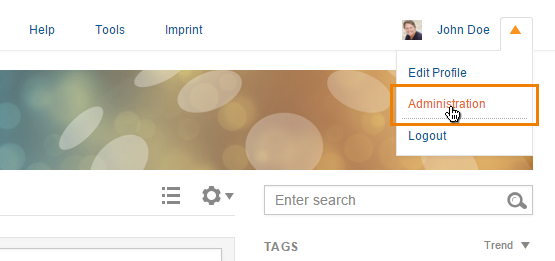

_Figure "Expanded Topbar"_

The "Administration" link will lead you to a new site:

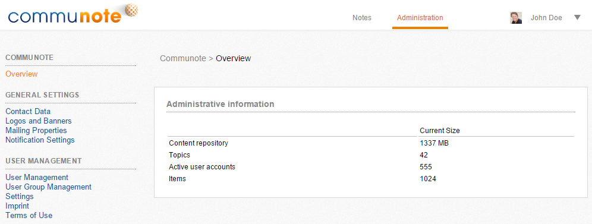

_Figure "Administration UI"_

The administration area is subdivided into the following areas:

* **General settings:** _change ui and mailing_
* **User management:** _manage user, groups and their rights_
* **Integration:** _external authentication, ldap and confluence settings_
* **Security:** _security and permission settings_
* **Application:** _clear cache, upload certificates and config the server_
* **Communication:** _mail in/out and XMPP settings_
* **Logging:** _view log entries_
* **Contents:** _attachment settings_
* **Extensions:** _overview of communote extensions and their settings_

Additionally to the administrator area it is possible for Communote administrators to add themselves as a topic manager. That way topics in which the topic manager is not available can still be managed by the admin. For example:

*   If the only topic manager has left the company
*   If the only topic manager is ill and/or not available

**Notice:** In order to avoid misuse, there will be an activity message in the topic that shows the new topic manager which can not be erased afterwards. That way all users of the topic can see the change in user's rights. Furthermore, all topic managers receive an email notification about the changes.

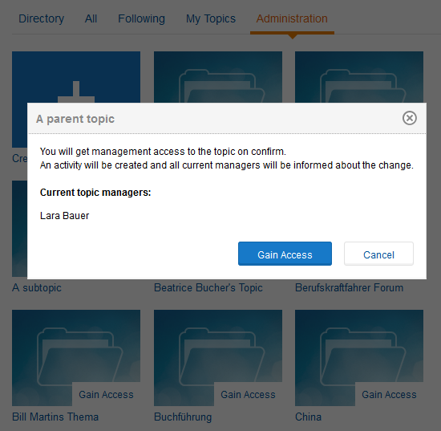

_Figure "Gain Access"_

## 1.2 General Settings

Here you will find the contact data that you have entered at the beginning of the Communote installation. You can change title and the standard timezone (system time by default) of your system.

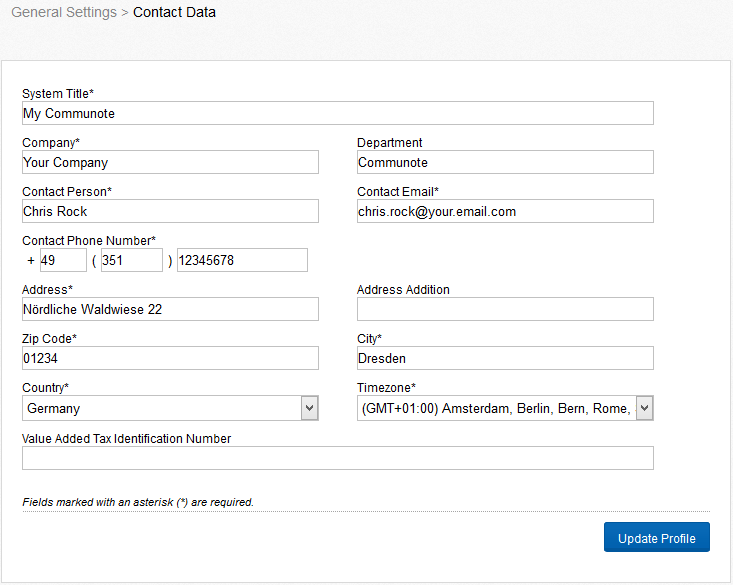

_Figure "Contact Data"_

You have the possibility to insert your own logo in Communote which will be visible in the upper left corner of the Communote interface. The logo should not be bigger than 220px in width and 40px in height. Select "Browse" and choose the correct file. Finish the process by selecting "Upload Logo". It is also possible to change the default banner and profile picture for topics.

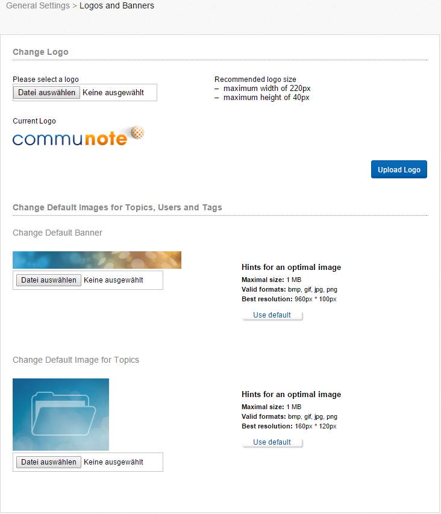

_Figure "Change Logo and Banner"_

In the mailing properties you can define an email address and a corresponding name to which the emails will be sent if a user for example respond to an invitation or registration mail. Emails that notify due to a creation or a change of a note are excluded from this rule. These emails use a topic-specific email address. In addition you can define a support address and a signature that will appear in every email that sent by Communote by default.

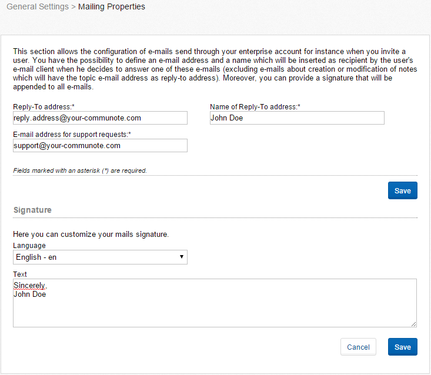

_Figure "Mailing Properties"_

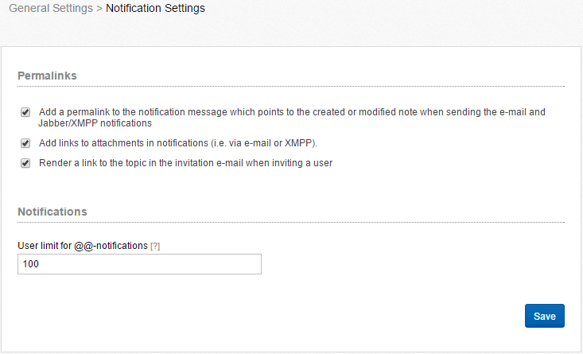

_Figure "Notification settings"_

Here you can decide whether notifications via email or xmpp include a permalink to the note and whether a hyperlink to an attachment will be added. You can also set a limit of users to address for the @@-notifications.

## 1.3 User Management

The user management consists of two parts that are each organized in a tab: An overview of all users as well as an area for the invitation of new users.
In the overview you can see all users that are registered in Communote in any kind of way. The name, the alias, the status and the role are displayed. The status of a user can be:

*   Invited: The user received an invitation.
*   Registered: The user responded to the invitation and registered.
*   Confirmed: If a user was invited by a topic manager, and the user finished his registration, it still requires activation by an administrator. The activation is not always necessary.
*   Activated: The user is activated and can work in Communote.
*   Deactivated: The user cannot log in anymore; his profile information and messages are still visible for other users though. An administrator can reactivate the user.
*   Deleted: The user cannot log in anymore and cannot be reactivated. His profile information and messages are still visible for other users.

Users can have the role "Member" or "Administrator". In the user management overview, filters can be set for names, statuses and roles. In addition the number of displayed search results per page can be defined.

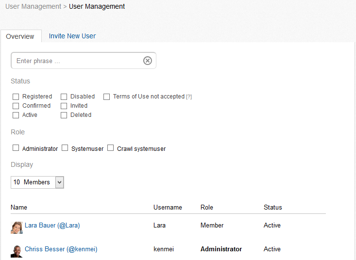

_Figure "User Management – Overview"_

Select an user to display and edit his information. Additional to the information that every user can access the administrator will see the user status, the role and the groups that the user belongs to.

_Figure "User Management – User Information"_

As an administrator you can invite new users to Communote. Depending on whether you set a connection to LDAP/ SharePoint/ Confluence in the integration settings and you marked this integration as primary authentication, you will see different input fields. In case of such an integration with activated primary authentication users can be invited by simply naming the alias and the e-mail address of the person. More for connecting to LDAP/ SharePoint/ Confluence, see chapter 1.44 The invited person will receive an e-mail with these data and can edit it if necessary. The difference to an invitation as a normal user is, that the invited users are activated right after their registration and do not have to wait for a further activation by the administrator. The user group management is also subdivided into two tabs. One tab gives an overview over the existing user groups and the other tab allows you to create new user groups. User groups provide the possibility of summarizing a certain group of people that belong to a certain department or project. These groups can be used for specifying topic access rights.

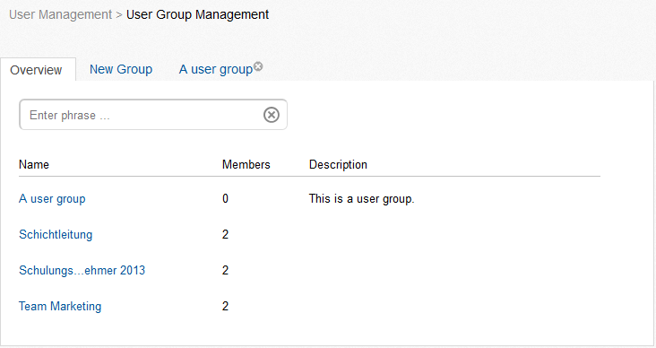

_Figure "User Group Management – Overview"_

In the tab "New Group" a new group can be created. You can define the name of the group, an alias and a description. You can add members to this group or include other groups in that group. Type the name the name or the alias of a user or the name of a different group in the search input field "Add member to group". Select one of the proposals and click "Add" to add the selected user or group to the group. In the lower part of the field you can see the users and groups that are already part of the group. These can be deleted by selecting "Delete" that appears when rolling over a user or a group with the mouse. A group can be edited after, by selecting the desired group from the list and by editing the corresponding information. The window is thereby the same like the one used for the creation of a group.

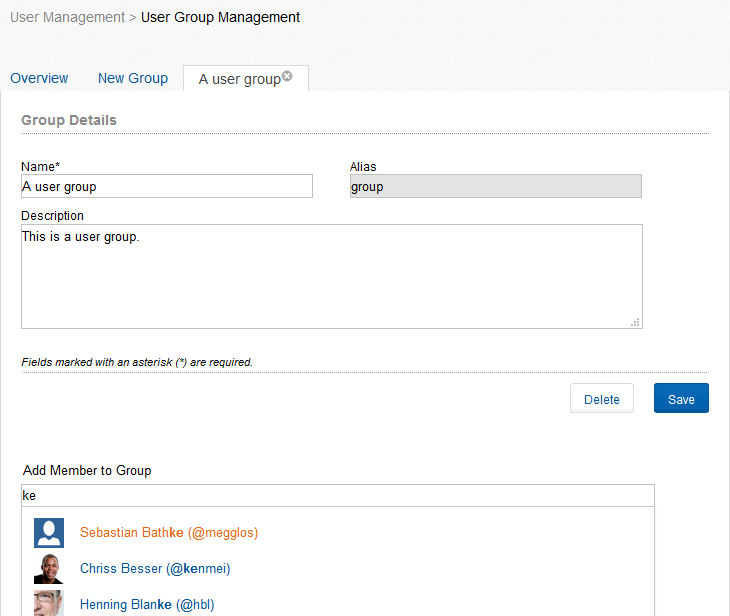

_Figure "User Group Management – Edit Group"_

the settings are splitted into two parts. users and groups. In the users - settings you can configure general settings, as well as settings concerning the deletion of users. In the general settings you can activate a feature that new users will be activated automatically. If this feature is not active, administrators will have to confirm every user. The second feature concerns the notification with an active integration. Check this one and the users will receive a notification when being activated on Communote, if they are being imported from another database. The third option is the creation of a user, which isn't yet present in communote, but,in an external system,for example LDAP, exist. When enabled, the user profile is automatically created. Communote relates the necessary data (name, first name and log in) from the external system. You also have the option of specifying a default language for new users. English is selected as the default language.

In the settings concerning the deletion of users you can define, whether a user is allowed to delete his account or not. You can allow a deletion with keeping his data or without. Data therefore means all notes and profile information of the user. If none of the fields is active, the user is not able to delete his profile at all. If both are active, the user can choose which option to take. If a user chooses to delete his account and to keep his data, his status will be set to deleted.

You can also configure the layoutsettings. Here you can configure how users will see the newsstream. You have the following settings for the default tab: "all notes", following, @[user] or bookmarks. "All notes" is the default setting after installation.

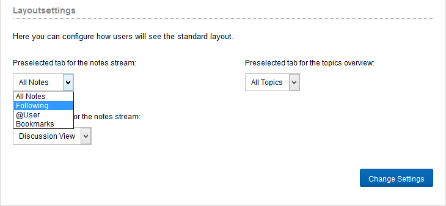

_Figure "Layout settings"_

In the groups-settings you can configure general settings for groups. With the functions "User Group Registration" is looked up, starting from the user in an externally connected system in which groups the user is located. If a group is found in which the user is located, this group is created when the function is active in Communote and the users assigned to this group. If the group already exists in Communote, the user of this group is added.

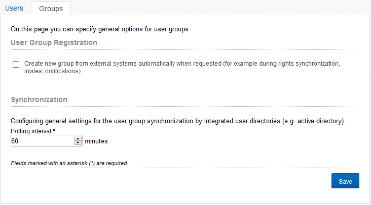

_Figure "General user group settings"_

With the polling interval you configure the interval in which Communote searchs  for changes of the included user directory, eg Active Directory and these optionally synchronized. You can also start a full synchronization by clicking on the appropriate button

## 1.4 Integration

### 1.4.1 Overview

On this site you can configure the way users are authenticated against Communote. Attention should be paid to:

*   It only possible to activate one external authentication. If no external authentication is activated, all users will be authenticated against the internal database.
*   The authentication against the internal database can only be deactivated, when there is at least one administration within the foreign system.
*   After switching back to the internal database users from foreign systems won't have passwords within the internal database and will not able to login. These users can create a new password using the "Forgot Password" functionality.

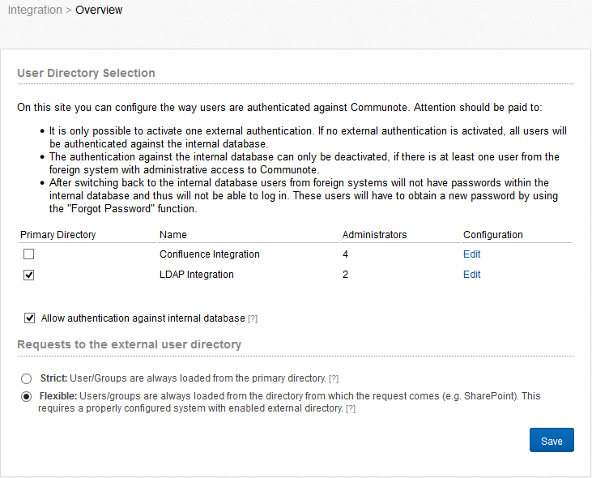

_Figure "Integration - Overview"_

To remove the tick at "allow authentication against internal database", you have to define a primary authentication and an administrator, for this.

With the option "requests to the external user directory" you can configure the mode to synchronize user information. Is the "Strict" mode activated, Communote will be  synchronized with the primary directory you have defined.  If you select the "flexible" mode, Communote searchs the user in the directory from which the request is made and synchronizes user information with this directory.

### 1.4.2 SharePoint and Confluence Configuration

Further information about the integration of Microsoft Sharepoint and Atlassian Conflunece can be found in our Supportportal Section "Integrations".

### 1.4.3 LDAP Configuration

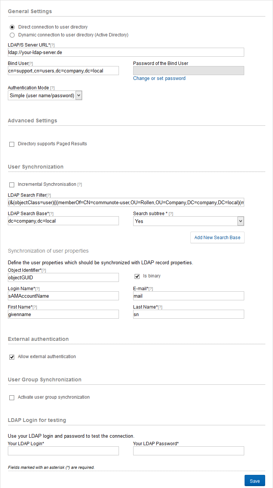

_Figure "LDAP Integration"_

You can choose between direct or dynamic connection to user directory. If you choose direct connection the LDAP server URL, the administrator login and the authentication mode are required for the LDAP integration. Provide the LDAP Server URL in the following format: _ldap://your.ldap.server:389_ Default is the port _389_, in case the LDAP Server you want to use runs on a different port you have to provide it.

When you choose the dynamic connection the query prefix and the domain are extra required. The query prefix is the attribute name of the SRV record that will be used in determining the LDAP server. With the advanced settings you can configure the paged results function. The directory must support this feature. Is this function activated, you can define the number of results per page.

Furthermore, a Bind User and password must be provided. As syntax for the bind user the full DN name must be used. This user is used for authentication for all LDAP requests.

The LDAP search base and the LDAP search filter are required for the User Synchronization. You can furthermore define if you want to search in sub trees.The LDAP Search Base defines which part of the LDAP will be considered by Communote for finding and authenticating users. If the field "search subtrees" is activated also user will be found which are contained in sub nodes of the LDAP Search Base:

* CN=Users,dc=company,DC=com

The LDAP Search Filter constraints the result set independent from the LDAP Search Base:

* (objectClass=*)

In case you do not know the configuration of your LDAP Server you may use tools such as "jexplorer" for exploring your LDAP. Such tools will help you to figure out the correct configuration. You have also the chance to activate the incremental synchronisation. The activation of the incremental synchronisation ensures that only changes since the last synchronisation will be requested.

In the following you have to name the attributes that are supposed to be synchronized with the Communote attributes. The synchronisation attributes are uid, alias, email, firstname, and lastname. Activate the field "isBinary" for "uid" if this attribute is a binary one.

For final storing of the configuration provide your login for a LDAP account. This is used for validation of the configuration. Before activation the LDAP integration Communote tries to login with the login data you provide. Only if Communote is able to retrieve a valid authentication with the current settings from the LDAP the integration will be activated.

Besides the support for authentication Communote also support the synchronisation of user groups using LDAP. Those groups can than be used for topic rights. The LDAP group synchronization can be activated by the field "User groups synchronisation". Here you have to define similar to the LDAP user authentication the LDAP Search Base and the search filter. You may also define several independent search bases. You also have to provide the LDAP attributes which will be used for creating a user group. Thos attributes are: the uid, the name of the group a short alias and an optional description of the group. Activate the field "isBinary" for "uid" in case the attribute is a binary one in the LDAP. You can also activate the incremental synchronisation for the group synchronistation.
Remark: All groups found will be created within Communote. Only users know to Communote will be assign to the groups. The user group synchronisation will not create new users. If a new users is activated by the administrator the synchronisation must run again before the groups are assigned for the new user. The synchronization of the groups based on DNs. With changes to the DN group, these Group are created new, which may lead to conflicts. In this case, the database must be adjusted manually.

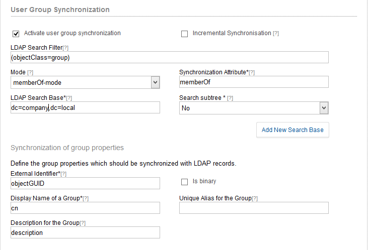

_Figure "LDAP Group Synchronization"_

To use a secured LDAP connection using SSL (LDAPS) simple use the correct url and port as value for the LDAP server url, i.e. <a rel="nofollow">ldaps://myDirectory.com:10636</a>. It might be necessary to make the servers certificate known to Communote, especially if your LDAPS server is using a self-signed certificate. This can be done via uploading the certificate at "Certificates" within the administration area (see chapter 2.1).

## 1.5 Security

On this page, you can choose how Communote should behave, if user logon attempt failed. Here you can specify the failed logon attempts to a temporary or permanent ban.
In the security settings you can specify whether users can define global read and write rights to their topics, meaning that they could all read the topic and create notes. You can also remove the previously set permissions for "All Users". This option is useful especially for users of older  Communote versions.

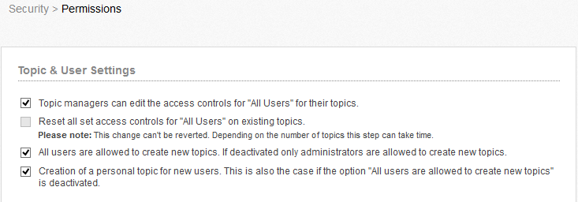

_Figure "Users and Topics Settings"_

The "Anonymous access" allows the activation of the anonymous read access to a topic. This means that users can read messages without them being registered in Communote. This setting is suitable for the use of plug-ins, especially in an intranet. In the administration area, this option will be capitalized on or off. If this option is enabled, which allows each business area managers to grant his subjects anonymous access. this is useful especially when sharing with external parties. Thus multiple authentications are possible. this means that no more external users in LDAP must register his, but can be registered only in Communote.

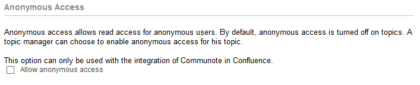

_Figure "Anonymous Access"_

Furthermore you can define whether you want to have a public topic that is open to everybody and that does not have a specific topic.

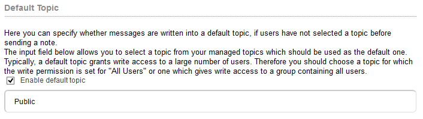

_Figure "Default Topic"_

The settings for the IP range filter consist of two tabs: The overview of the already created filters and a tab for the creation of new filters. Define the name of the filter, decide whether it should be activated and for which sectors (API, RSS, WEB, and XMPP) it should be enabled. Afterwards type in an IP address or different ranges of IP addresses.
If a user requests content from Communote the IP address of the user will be checked against the filter. Only if the IP address is not excluded or is in at least one include (if one is defined) the user can access Communote.

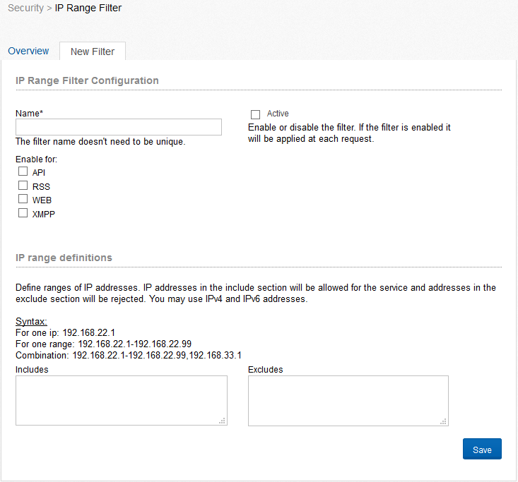

_Figure "IP Range Filter"_

SSL (Secure Sockets Layer) will be used automatically at login and registration processes for a secure transfer of data. You can furthermore define here, for which channel SSL should be forced. You have the choice between WEB, API and RSS. If the user requests content unsecure but the channel requires secure access a redirect will be send.

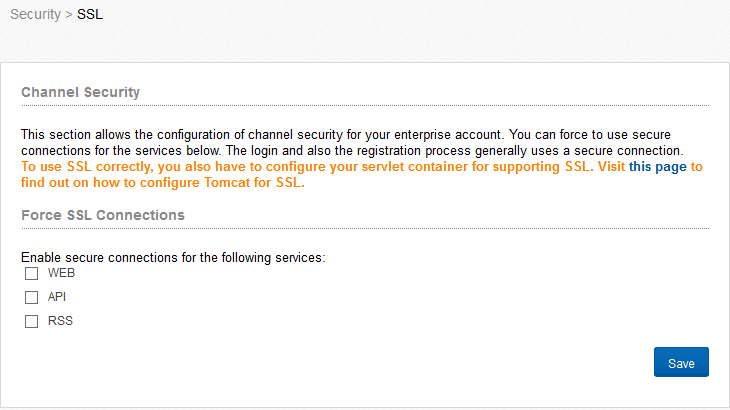

_Figure "SSL"_
