The options mentioned in this section are visible only to administrators who use their own installation.

## 2.1 Application

Define the address at which your server is reachable. It will be used to display links in emails or other notifications correctly. This is necessary if for example your server is not reachable directly and requests have to be redirected to another server e.g. a firewall.
**Note**: Please check the box "server supports HTTPS" only if this is the case, as otherwise it may happen that your server is no longer available. Try it simply by replacing "http" with "https" in the address bar of your browser.

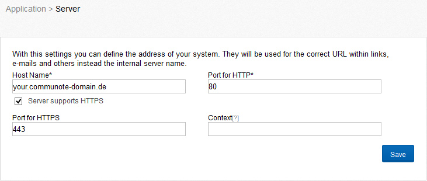

_Figure "Server Setup"_

To run Communote in another context you have to add the contexts name as value for the field "context".

Communote offers the possibility to check all file uploads for viruses and to discard infected files if necessary, to prevent that computer viruses are spread via the microblogging system. The configuration area "Virus Scanner" provides the possibility to set up Communote for the use of an external anti-virus scanner.
There are two options for the configuration. You can connect to an externally installed Clam Antivirus Service (Figure "Virus Scanner" - top) or use a command-line virus scanner (Figure "Virus Scanner" - bottom) alternatively.
Clam AV is a free virus scanner, which can be obtained at the following URL: [http://www.clamav.net](http://www.clamav.net).

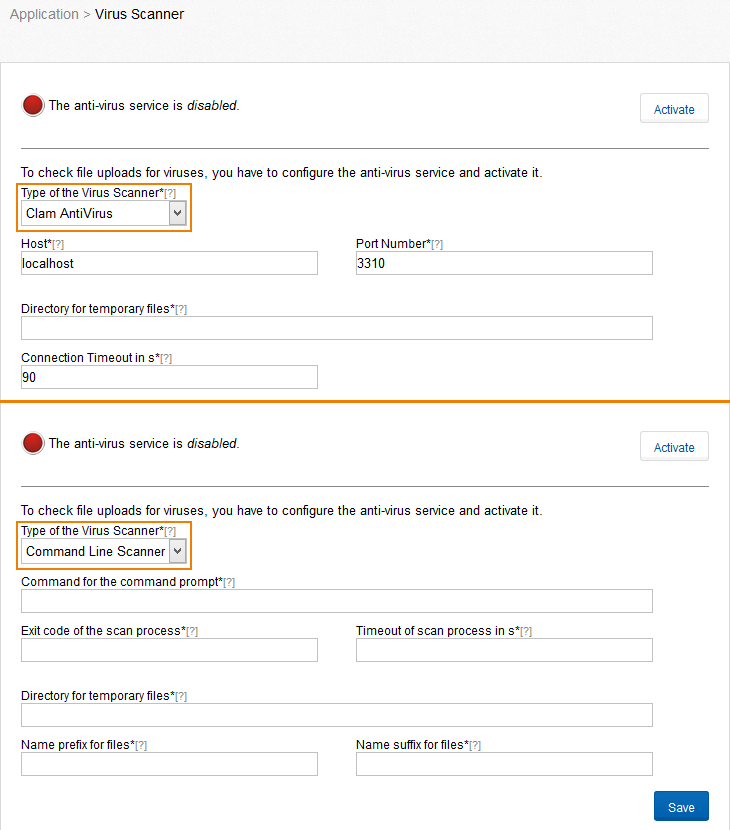

_Figure "Virus Scanner"_

After enabling the virus scanner, check whether the file upload still works. If the virus scanner is configured incorrectly, no files can be uploaded! Check also whether the virus scanner detects a test virus properly. This is possible with the test virus eicar: [http://www.eicar.org/anti_virus_test_file.htm](http://www.eicar.org/anti_virus_test_file.htm)
This list contains certificates that are used to build trusted connections to other systems, e.g. to connect to the mail server for outgoing e-mails. At the beginning the list includes all certificates of your installed version of Java. More certificates can be uploaded via the tab "Upload Certificate". These must be of the format X.509 version 3.
Valid certificates are marked with  and expired with . Certificates whose validity starts in the future are marked with .

To delete certificates move the mouse over the certificate and press the red icon that appears at the end of the line.
**Note:** Changes to certificates require a restart of the application.

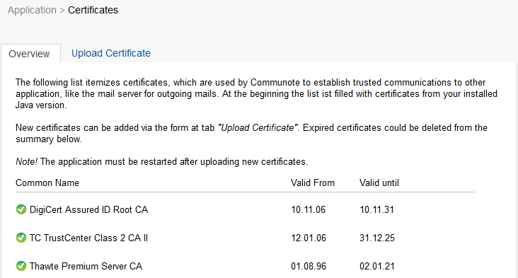

_Figure "Certificates - Overview"_

## 2.2 Communication

In this section you can configure Communote for receiving e-mails (see Figure 2 5). You have to specify the credentials of the IMAP server and the e-mail address.
When Mail-In is configured and activated, Communote will check for incoming mails and post the content of the mail to the associated topic. The mail itself will be marked as deleted on the mail server, as soon as Communote created a post in the topic successfully.
In case the content of the mail contained a notification defined by the "@" syntax and the users that should be notified do not have the right to read the topic, the message will be created in Communote but the user will only receive an info email. The same happens in case that the message contained a cross topic reference denoted by "&" and the sender of the email does not have write right on those topics.
In the following cases no message will be created in Communote, but the message will be marked as deleted on the mail server. However the user will receive an info message, if:

*   The creation of the note failed (for example the topic alias does not exist),
*   The email contained no content,
*   The email has been sent by an unknown user. (A user is unknown if there is no user within Communote with this e-mail address).

The Mail-In of Communote offers two options to assign e-mails to a specific topic: the "Single Address Mode" and the "Multi Address Mode".
In the "Single Address Mode" there is only a single recipient address that the user can use to send e-mails to Communote (Figure "Single Address Mode"). The assignment to a topic will be defined by the subject of the e-mail. The subject must contain the alias of the topic within squared brackets (e.g. "[topic]"). The sender of the email will be the author of the note to be created. As a basic principle: E-mails of users that are unknown in Communote and that have an incorrect topic alias, will be marked for deletion on the mail server without any notice to the user.
In the "**Multi Address Mode**" every topic will be associated with an own e-mail address that is predefined by a certain pattern (Figure "Multi Address Mode"). The content of the subject line of the e-mail will be ignored and not included in the note in this mode. Again, the sender will be used as author for the note. E-mails that do not match the e-mail pattern will be ignored on the mail server.

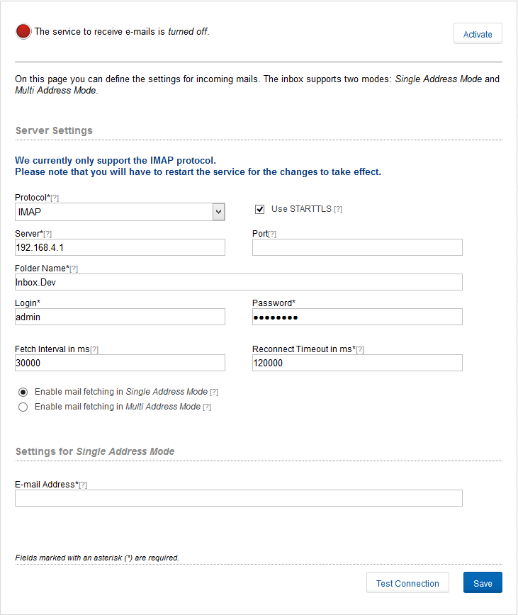

_Figure "Single Address Mode"_

_Figure "Multi Address Mode"_

In this part you specify the settings for outgoing e-mails and configure a server (Figure "Mail Out Settings"). These settings are important so Communote can send emails, for example to users during the registration process, to confirm the e-mail address of an user or to send system messages to the administrator.

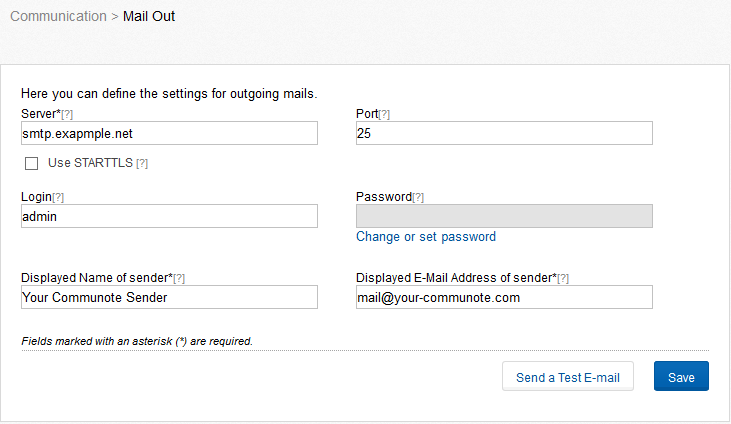

_Figure "Mail Out Settings"_

Communote supports the delivery (currently only notifications) and receiving of messages via XMPP.
**Note**: For using the XMPP feature an additional XMPP server is necessary. At the moment only _Openfire_ is supported by Communote. Plug-in are available for these servers, but must be installed before. You will find a detailed installation and configuration instruction of Openfire in section 2 in the installation manual.
Under the menu item "Openfire", as well as in the installation manual, you will find instructions how to configure a xmpp-server to communicate with communote.
Under the „Client Configuration" tab (Figure "Client Configuration") you must specify the login credentials of the bots. The credentials you should get from your XMPP server operator.
Note: when configuring the access it is important to note that the login is not specified by the full Jabber ID (JID) , but only the part before the @ symbol.
For example: the full JID of the bot is _<a rel="nofollow">„CommunoteBot@myJabberServer.com</a>",_ then the login is _„CommunoteBot"._

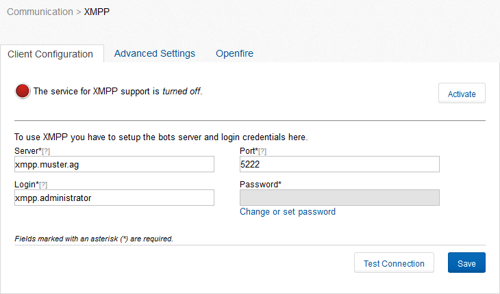

_Figure "Client Configuration"_

In the second tab "Advanced Settings" (Figure "Advanced Settings"), you need adjustments to make needed by the bot, so he can properly send and receive messages. These settings are used in similar form by the XMPP server.
The value "_Suffix for Users_" generally consists of the @-Symbol and the Address of the server with the Communote instance and is used to cut the communote username from the jabber id of the user in the xmpp- server. Is your Communote instance under the address "[http://www.mycommunote.com_"_](http://www.mycommunote.com_%22_) available, the value for "suffix for user" likely "_@mycommunote.com_".
The "_Suffix for Topics_" is needed to separate the Jabber ID of the topic of the actual alias of the topic in Communote. The first character must include the @ symbol. After the first character comes a selectable word and the address of your Communote server. The word must be selectable in the Openfire server for the subdomain using the alias (see tab "Open Fire"). With the „Posting Interval in ms" you can set how long users must wait between sending two messages over XMPP.

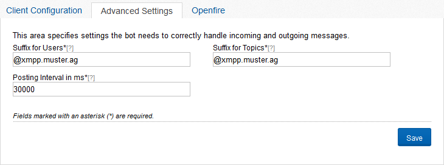

_Figure "Advanced Settings"_

## 2.3 Logging

In the logging section you have direct access to the log files of communote. Also you can download them.
For instructions on configuring logging, see the Installation manual on chapter "3.1 Logsfiles ".

## 2.4 Contents

Here you specify where Communote stores uploaded attachments. Communote must have write permission for this directory (Figure "File Storage").
**Note:** If you change the directory you have to copy the contents of the original directory manually to the new directory, because otherwise existing attachments are no longer available.

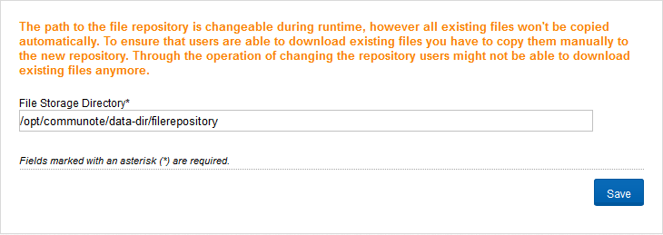

_Figure "File Storage"_

On this page you can set the limits for user pictures (including logos) and attachments. To prohibit the uploading generally you can enter a value of 0 (zero). The values are in KB (kilo bytes). Figure "File Upload" shows an example in which the maximum attachment size is 10 MB and user pictures and logos are limited to 1 MB.

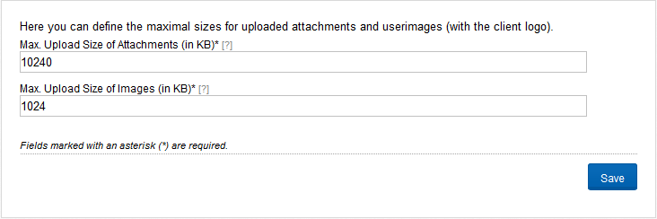

_Figure "File Upload"_

## 2.5 Extensions

On this page you can find an overview about all installed plugins and there version and there status.

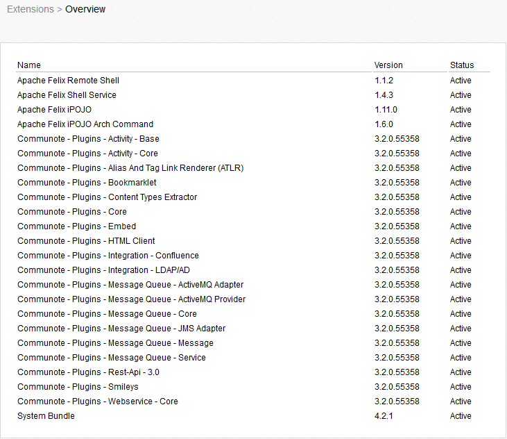

_Figure "Extensions Overview"_

Also you can find the configuration options for the activities, and other plugins. Activities of a user (if a system user) triggered events to be displayed in Communote by a system message. The system message describes the action that the person has performed with or on an object. A user activity, for example, changes to access rights have to be a topic. Communote stores always themed activities, as well as user-specific. This means that an activity message is assigned to the user who triggered the event and the activity message in the message flow of the associated topic. The activities are subdivided into  Communote and external activities which eg be triggered by SharePoint.

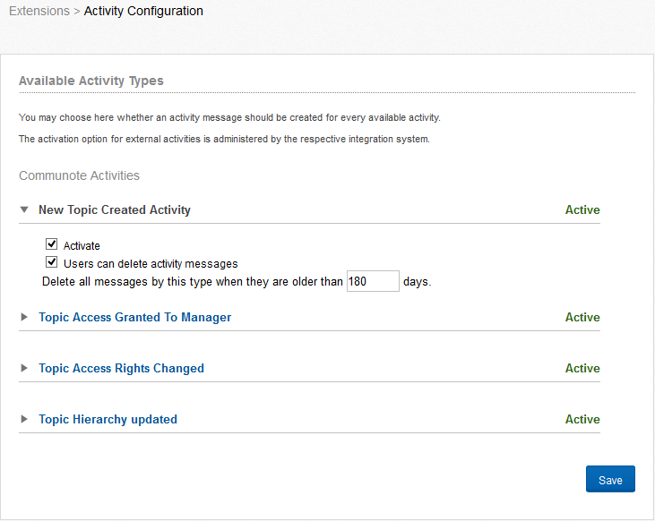

_Figure "Activities"_

For each available activity, you can define whether a message is created or not. You can also specify whether and how many days after, the messages are deleted from your Commuote.

If this option of activating, is turned off, is an activity that is controlled by an integration system. In external activities, the setting of the integration of these systems are activated.
