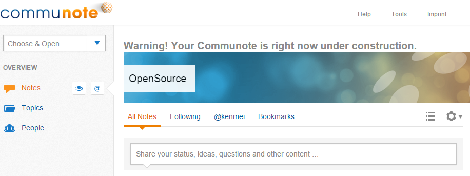
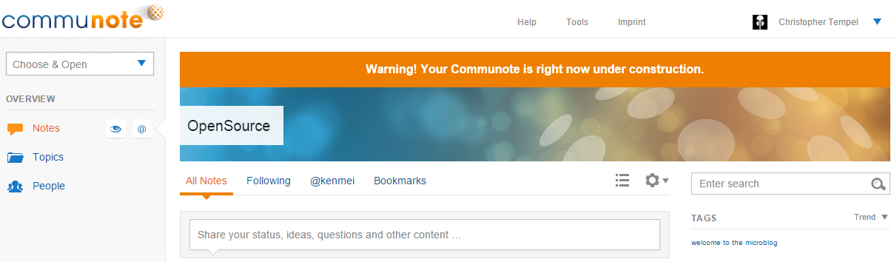
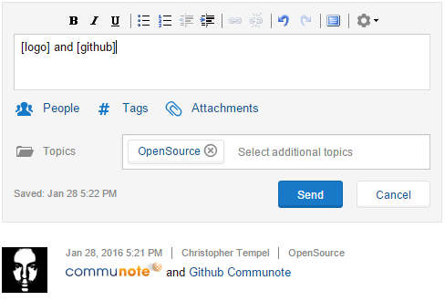
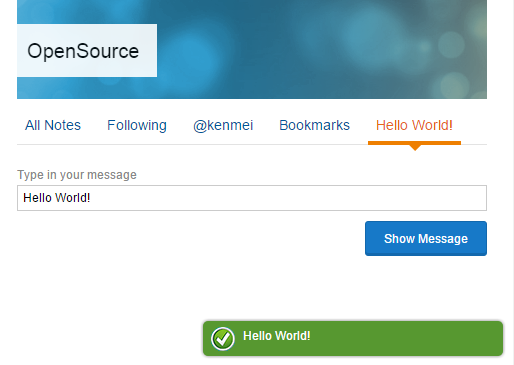

Communote uses OSGi (Apache Felix) in conjuction with Apache iPOJO for offering extensibility  and variability in an easy way. This also provides the possibility to add and remove plugins while Communote runs. Currently it is possible to:

* Replace existing templates and though creating your own theme,
* Add your own controller for a specific URL,
* Add your own  NoteRenderingPreProcessor.

## 1.2.1 Creating a Plugin using Maven

The easiest way to create a new plugin is to use Mavens [archetype](http://maven.apache.org/guides/introduction/introduction-to-archetypes.html) mechanism.

1. Open a command line
2. Change to the folder you want to create the plugin in
3. Call the following command (change the values for groupID, artifactId and version to your needs):

   ```shell
   mvn archetype:generate -DgroupId=yourGroupId -DartifactId=yourPluginsArtifactId -Dversion=1.0-SNAPSHOT -DarchetypeArtifactId=communote-plugin-archetype -DarchetypeGroupId=com.communote.plugins -DarchetypeVersion=2.1.1-SNAPSHOT
   ```

The value for `archetypeVersion` specifies the version of Communote your plugin should be written for.

ToDo: Slim the generated folder structure of the archetype artifact.

## 1.2.2 Example 1 - Extend Note Rendering

In this example we would like to create a plugin to extend the note rendering pre processor. We will define two placeholders named `[logo]` and `[github]`, which will be later replaced by our plugin to the Communote logo and a link to our Github. Furthermore we want the alternative text of the logo and the link text localized. Before you start maybe it's good to create a message via JavaScript, which will show the user that your Communote is under construction.

1. To generate such a construction message you have to create a JavaScript file `construction.js` at `src\main\resources\META-INF\resources\static\javascript`:

   ```javascript
   // Jumps in when the namespace Communote and the main layout is loaded
   if (window.communote && communote.environment && communote.environment.page == 'main') {
       // Add the construction container before Communote start to initialize everything
       communote.initializer.addBeforeInitCallback(function() {
           //... it generates a container with a localized message and append it at the top
           var constructionContainer  = new Element('div', {
                   id: 'construction-container',
                   html: '<h1>' + communote.i18n.getMessage("plugins.communote.tutorial.construction.text") + '</h1>'
               });
           constructionContainer.inject($('cn-view-wrapper'), 'top');
       });
   }
   ```

   With the `communote.i18n.getMessage()` function you are able to search for translation message keys.

2. You need to create a message properties at `src\main\resources\META-INF\resources\i18n` to store the keys with there translation:
   * `messages_en.properties` (for the English translation) and insert:

     ````properties
     plugins.communote.tutorial.construction.text=Warning! Your Communote is right now under construction.
     ````

   * `messages_de.properties` (for the German translation) and insert:

     ````properties
     plugins.communote.tutorial.construction.text=Achtung! Ihr Communote ist gerade im Aufbau.
     ````

3. But you are not able to use these message keys in the JavaScript context so we need a extension to register them. Go to your plugin Java folder where the `Activator.java` takes place and delete the file because in this example we do not need it. Create instead at the same folder the java file called `TutorialJsMessages`:

   ```java
   @Component
   @Provides
   @Instantiate
   public class TutorialJsMessages implements JsMessagesExtension {

      @Override
      public Map<String, Set<String>> getJsMessageKeys() {
         HashSet<String> messageKeys = new HashSet<String>();
         // Add the message keys you need to access via your JavaScript file
         messageKeys.add("plugins.communote.tutorial.construction.text");

         HashMap<String, Set<String>> mapping = new HashMap<String, Set<String>>();
         // Define the context where you have access to the message keys
         mapping.put(JsMessagesRegistry.CATEGORY_PORTAL, messageKeys);
         return mapping;
      }
   }

   ```

4. You also need to register your JavaScript file in your plugin. That is why we need a JSON file called `javascript-categories.json` at `src\main\resources\META-INF\resources\`:

   ```json
   {
      "extensions": {
         "portal": ["javascript/construction.js"]
      }
   }
   ```

5. Build the plugin with a simple `mvn` and deploy the jar file at the target folder to your Communote data plugin directory (e.g. `D:\Communote\Data\plugins`). Reload your Communote and when everything is good you will see this:

    

    _Figure "Result of the construction message with no style"_

6. You probably recognized that the construction message have no style. Therefore we create a `style.css` at `src\main\resources\META-INF\resources\static\styles`:

   ```css
   #construction-container {
      background-color: #ee7f01;
      padding: 15px;
      text-align: center;
   }

   #construction-container h1 {
      color: #FFFFFF;
      font-size: 16px;
      margin: 0;
   }
   ```

7. The CSS file needs also to register like the JavaScript files with a JSON file called `css-categories.json` at `src\main\resources\META-INF\resources\`:

   ```json
   {
      "extensions": {
         "portal": ["styles/style.css"]
      }
   }
   ```

    If you build and deploy the plugin again it will looks like this:

    

    _Figure "Result of the construction message with no style"_

    Now you can start going deeper and extend the note rendering process to manipulate the content of a note.

8. Go to your java folder to create a new java file called `TutorialNoteRenderingPreProcessor.java`, that implements the `NoteContentRenderingPreProcessor` to extend the note rendering process:

   ```java
   @Component
   @Provides
   @Instantiate(name = "TutorialNoteRenderingPreProcessor")
   public class TutorialNoteRenderingPreProcessor implements NoteContentRenderingPreProcessor {

      /**
        * @return the order value which is interpreted as the priority of the pre-processor. The higher
        *         the priority, the earlier this processor will be called.
      */
      @Override
      public int getOrder() {
         return DEFAULT_ORDER;
      }

      /**
        * @return whether the result can be cached. This method has to return false if this
        *         PreProcessor modifies the content in a way that depends on other NoteRenderContext
        *         attributes than the NoteRenderMode (e.g. locale, request attributes or modeOptions).
        *         This PreProcessor should not modify the note metadata (NoteListData object) while
        *         processing the content if this method returns true because the PreProcessor will not
        *         be invoked if the processed content was cached.
      */
      @Override
      public boolean isCachable() {
         return true;
      }

      /**
        * Processes a note for a specific render context. This method will only be called if the
        * processor supports the mode given by the render context.
        *
        * @param context
        *            holds details about the render context to allow specific processing in different
        *            situations
        * @param item
        *            the item to be processed
        * @return true if the item was modified, false otherwise
        * @throws com.communote.server.plugins.api.NoteRenderingPreProcessorException
        *             in case something unexpected lead to the failure of the processor
      */
      @Override
      public boolean processNoteContent(NoteRenderContext context, NoteListData item)
         throws NoteRenderingPreProcessorException {
         return false;
      }

      /**
        * Denotes whether the pre-processor replaces the note content completely.
        *
        * @return true if the processor replaces the content and the shortened content completely. If
        *         the processor only modifies parts of the content or other members of the item, false
        *         should be returned. When replacing content the new content must match the render
        *         mode.
      */
      @Override
      public boolean replacesContent() {
         return false;
      }

      /**
        * Whether the processor supports a specific render mode. When returning true and the processor
        * modifies or replaces the note content it must ensure that it only inserts text which matches
        * the render mode, specifically the processor shouldn't insert HTML markup when called in PLAIN
        * mode.
        *
        * @param mode
        *            the note render mode, never null
        * @param note
        *            the note to render. A pre-processor can use this parameter to decide based on note
        *            attributes whether the note content should be processed
        * @return true if the mode can be handled by the processor, false otherwise
      */
      @Override
      public boolean supports(NoteRenderMode mode, NoteListData item) {
         return NoteRenderMode.PORTAL.equals(mode);
      }
   }
   ```

9. Define a list of your replacements globally:

   ```java
   // Definition of the replacements list
   private final static List<Pair<String, String>> REPLACEMENTS = new ArrayList<>();

   // On the left side of our pair are the placeholders and on the right side are the HTML replacements
   static {
      REPLACEMENTS.add(new Pair<>("[logo]", "<span class=\"communote-logo\"></span>"));
      REPLACEMENTS.add(new Pair<>("[github]", "<a href=\"http://github.com/communote\">Github Communote</a>"));
   }
   ```

10. Jump into the function `processNoteContent(NoteRenderContext context, NoteListData item)` and you can use the `item` object to get and set the short and full content of a note:

    ```java
    public boolean processNoteContent(NoteRenderContext context, NoteListData item)
       throws NoteRenderingPreProcessorException {
       // Setting the new content of the note delivered by the replacement function
       item.setContent(processContent(item.getContent()));
       // ... and do the same for the short preview content
       item.setShortContent(processContent(item.getShortContent()));
       return true;
    }
    ```

11. You now able to create the new function `processContent(content)` with the current content as variable that needs to be replaced:

    ```java
    private String processContent(String content, Locale locale) {
       // Do nothing if the content is null
       if (content == null) {
          return null;
       }

       // Searching for the "[logo]" and "[github] placeholder to replace them with the HTML defined above
       for (Pair<String, String> replacement : REPLACEMENTS) {
          content = content.replace(replacement.getLeft(), replacement.getRight());
       }
       return content;
    }
    ```

12. Nearly done. For the image replacement you need a style for the `.communote-logo` class and the logo image.

    1. Upload the `logo.png` at `src\main\resources\META-INF\resources\static\images```
    2. Add to your CSS file `style.css` the following class:

       ````css
       .communote-logo {
         background-image: url("../images/logo.png");
         display: inline-block;
         height: 16px;
         width: 106px;
       }
       ````

13. Build the plugin with a simple ```mvn``` and deploy the jar file at the target folder to your Communote data plugin directory (e.g. `D:\Communote\Data\plugins`). Reload your Communote and when everything is go you will see this:

    

    _Figure "Result for Example 1 - Extend Note Rendering"_

## 1.2.3 Example 2 - Create a view with a widget
This example will explain you how to create a view at the notes overview with one simple widget on it.

1. At the horizontal navigation next to the bookmarklet link we want to register a new view with a widget as content.
   Lets start at your `resources/static/javascript` folder and place a new javascript file `CreateHelloWorldView.js` in it:

   ```javascript
   // Jumps in when the namespace communote and the main layout is loaded
   if (window.communote && communote.environment && communote.environment.page == 'main') {
     // Add the new view before Communote start to initialize everything
     communote.initializer.addBeforeInitCallback(function() {
       var widgets, views;
       // Parent view name where the new subview takes place (other examples are topicsOverview or topicSelected)
       var parentViewId = 'notesOverview';
       // Name of the new subview
       var viewName = 'helloWorld';
       var subViewName = parentViewId + '_' + viewName;

       // Register view link to horizontal navigation bar
       communote.configuration.mainPageContexts[parentViewId].push(viewName);

       // Get list of all views
       views = communote.configuration.mainPageViewManagerConfig.views;

       // Add the new view to the list of views
       views[subViewName] = {
         // When the user change the view and 'hide' is defined the view container will hidden by display: none;
         // Another option is 'delete' for delete from the DOM
         previousViewAction: 'hide',
         // List of shown widgets for the view
         visibleWidgets: ['EntityChooser','VerticalNavigation',
           'HorizontalNavigation', 'GlobalIdShowBannerImage', 'HelloWorld']
           // You can also add parentViewId: 'insertMainView' as an option
           // to extend the visible widgets of a main view
       }

       // Get list of all widgets
       widgets = communote.configuration.mainPageViewManagerConfig.widgets;

       // Add a HelloWorld widget to the list of widgets
       widgets['HelloWorld'] = {
         // Rendered as a CSS class to the widget
         // and act as identifier for the java and the javascript class without the "Widget" suffix
         widgetType: 'HelloWorld',
         // The CSS selector defines where the widget takes place
         containerSelector: '#cn-list-posts'
       };
     });
   }
   ```
2. Localize the name of the new horizontal navigation point via the message properties:
    * `messages_en.properties`

      ````properties
      mainpage.horizontal.navigation.notesOverview.helloWorld=Hello World!
      ````   

    * `messages_de.properties`

      ````properties
      mainpage.horizontal.navigation.notesOverview.helloWorld=Hallo Welt!
      ````

    The key ```notesOverview``` stands for the parent view and ```helloWorld``` for our new subview.

3. In step 1 we also add a new widget to the view. A widget needs a Java and a JavaScript class.  
    1. Lets start with the Java class `HelloWorldWidget.java` which needs to created at your Java folder:

       ````java
       public class HelloWorldWidget extends EmptyWidget {

           @Override
           public String getTile(String outputType) {
             // key of the vm.tiles-mappings.properties entry whose value holds
             // the path of the velocity file which should be rendered
             return "com.communote.tutorial.HelloWorld.widget";
           }
       }
       ````
    2. The tiles are mapped at the file `resources/META-INF/resources/vm.tiles-mappings.properties`:

       ````properties
       com.communote.tutorial.HelloWorld.widget=/vm/widget/HelloWorld.Widget.html.vm
       ````

    3. The linked Velocity file `HelloWorld.Widget.html.vm` needs to be placed at `resources/META-INF/resources/vm/widget/` and have the following content:

       ````html
       ##
       ## $widgetInstance -> via the widget instance it is possible to access functions and variables by the JavaScript widget class
       ##
       #set($widgetInstance = "#jsCurrentWidget()")
       <div class="cn-form-container">
           <div class="cn-field-50">
               <label class="cn-label" for="${widget.WidgetId}_message">
                   ## In order to internationalize your code use the helper functions #t(key) and #t_args(key, arguments)
                   #t('plugins.communote.tutorial.widget.HelloWorld.input.label')
               </label>
               <input type="text" class="cn-inputTxt" id="${widget.WidgetId}_message" name="${widget.WidgetId}_message" />
           </div>
           <div class="cn-buttons">
               ## Using the widget instance to define an onclick event for the button
               <input type="button" id="${widget.WidgetId}-show" name="${widget.WidgetId}-show" class="cn-button main"
                      value="#t('plugins.communote.tutorial.widget.HelloWorld.button')" onclick="${widgetInstance}.showSuccessMessage()"/>
           </div>
       </div>
       ````
       With this widget template the user can write a text and click on the button to generate it as a Communote notification.

    3. In this case we  your JavaScript folder you can create the widget class `HelloWorld.Widget.js`:

       ````javascript
       (function(namespace) {
           var HelloWorldWidget = new Class({
               Extends: C_Widget,
               /*
               First part "plugin/" is required and marks the widget as one that is provided by a plugin.
               The maven placeholder is needed to create an unique widget group name based on the name of the OSGi bundle and
               will be replaced by building the plugin.
               */
               widgetGroup: 'plugin/${maven-symbolicname}',

               //This function prints out the input value via a notification
               showSuccessMessage: function() {
                   var message = this.domNode.getElementById(this.widgetId + '_message').get("value")
                   showNotification(NOTIFICATION_BOX_TYPES.success, null, message);
               }
           });

           // to register the widget constructor within the Communote namespace
           namespace.addConstructor('HelloWorldWidget', HelloWorldWidget);

       })(window.runtimeNamespace);
       ````

    4. You need to edit your pom.xml file and configure the filter process to get the maven placeholder to be replaced:

       ````xml
       ...
       <defaultGoal>package</defaultGoal>
       <resources>
           <resource>
               <directory>src/main/resources</directory>
               <filtering>true</filtering>
               <includes>
                   <include>**/*.vm</include>
                   <!-- to replace maven placeholders in Widget files -->
                   <include>**/javascript/*.js</include>
                   <include>**/error_*.html</include>
               </includes>
           </resource>
           <resource>
               <directory>src/main/resources</directory>
               <filtering>false</filtering>
               <excludes>
                   <exclude>**/*.vm</exclude>
                   <exclude>**/javascript/*.js</exclude>
                   <exclude>**/error_*.html</exclude>
               </excludes>
           </resource>
       </resources>
       ...
       ````

       In order to filter also the minified JavaScripts add this plugin:

       ````xml
       <plugin>
         <groupId>org.codehaus.mojo</groupId>
         <artifactId>build-helper-maven-plugin</artifactId>
         <executions>
           <execution>
             <id>add-minimized-css-and-js</id>
             <phase>generate-resources</phase>
             <goals>
               <goal>add-resource</goal>
             </goals>
             <configuration>
               <resources>
                 <resource>
                   <!-- add bundle name to widgetGroup for minimized files -->
                   <directory>src-gen/minimized</directory>
                   <filtering>true</filtering>
                   <includes>
                     <include>**/*Widget-min.js</include>
                   </includes>
                 </resource>
                 <resource>
                   <directory>src-gen/minimized</directory>
                   <filtering>false</filtering>
                   <includes>
                     <include>**/*-min.js</include>
                     <include>**/*-min.css</include>
                   </includes>
                   <excludes>
                     <exclude>**/*Widget-min.js</exclude>
                   </excludes>
                 </resource>
               </resources>
             </configuration>
           </execution>
         </executions>
       </plugin>
       ````
    6. It is time to register both JavaScript files at your plugin in the `javascript-categories.json` at `resources/META-INF/resources/`:

       ````json
       {
         "extensions": {
           "portal": [
             "javascript/HelloWorld.Widget.js",
             "javascript/CreateHelloWorldView.js"]
           }
       }
       ````

    7. We used some translation keys at the widget velocity template you need to add:

       * `messages_en.properties`

         ````properties
         plugins.communote.tutorial.widget.HelloWorld.input.label=Type in your message
         plugins.communote.tutorial.widget.HelloWorld.button=Show Message
         ````  

       * `messages_de.properties`

         ````properties
         plugins.communote.tutorial.widget.HelloWorld.input.label=Deine Nachricht
         plugins.communote.tutorial.widget.HelloWorld.button=Nachricht senden
         ````

4. Now we need an widget factory class `TutorialWidgetFactory.java` for our plugin in your Java folder. This factory creates an instance of our widget with the given widget group and widget type name:

   ```java
   @Component
   @Instantiate
   public class TutorialWidgetFactory implements WidgetFactory {

       private final String symbolicName;

       /**
        * Constructs the widget factory
        *
        * @param bundleContext
        *            the context of the bundle
        */
       public TutorialWidgetFactory(BundleContext bundleContext) {
           // Saving the context of the plugin to stop and start the factory
           this.symbolicName = bundleContext.getBundle().getSymbolicName();
       }

       /**
        * Create a new widget instance that should handle the current widget request.
        *
        * @param widgetGroupName
        *            the group of the widget
        * @param widgetName
        *            the name of the widget
        * @param requestParameters
        *            the request parameters of the current request
        * @return the new widget instance
        * @throws WidgetCreationException
        *             in case the widget cannot be created
        */
       @Override
       public Widget createWidget(String widgetGroupName, String widgetName,
           Map<String, String[]> requestParameters) throws WidgetCreationException {
           // Return the new widget instance
           return new HelloWorldWidget();
       }

       /**
        * Plugin start callback to register the factory.
        */
       @Validate
       public void start() {
           WebServiceLocater.instance().getService(WidgetFactoryRegistry.class)
                      .addWidgetFactory(this.symbolicName, this);
       }

       /**
        * Plugin stop callback to remove the factory.
        */
       @Invalidate
       public void stop() {
           WebServiceLocater.instance().getService(WidgetFactoryRegistry.class).removeWidgetFactory(
                      this.symbolicName);
       }
   }
   ```

5. Done!

   

   _Figure "Result for Example 2 - Create a view with a widget"_


## 1.2.4 Other Plugin examples

You can download and look through other examples:

* [communote-development-examples-plugin](https://github.com/communote/communote-development-examples-plugin)
* [communote-example-external-authentication](https://github.com/communote/communote-example-external-authentication)

## 1.2.5 Platform Extension Points

### 1.2.5.1 Extend Notes, Tags, Users

<div class="table-responsive">
  <table class="table">
  	<thead><tr><th>What to extend</th><th>Class/Interface</th></tr></thead>
  	<tbody>
      <tr>
        <td><strong>Note content before stored</strong><br /><br />
        This interface allows to edit the content of a note before it is stored at the database.</td>
        <td>NoteStoringEditableContentPreProcessor</td>
      </tr>
  		<tr>
  			<td><strong>Note metadata before stored</strong><br /><br />
        This interface allows to edit the metadata of a note before it is stored at the database.</td>
  			<td>NoteStoringImmutableContentPreProcessor</td>
  		</tr>
  		<tr>
  			<td><strong>Note content rendering</strong><br /><br />
  			Allows to execute logic after the note is saved. At the point of manipulation the note is already stored at the database. The process is working async.
  			Overwrite the <code class="highlighter-rouge">processNoteContent()</code> and manipulate the content with their getter and setter functions of the item object.</td>
  			<td>NoteContentRenderingPreProcessor</td>
  		</tr>
  		<tr>
  			<td><strong>Note metadata rendering</strong><br /><br />
  			Allows to execute logic after the note is saved. At the point of manipulation the note is already stored at the database. The process is working async.
  			Overwrite the <code class="highlighter-rouge">processNote()</code> and manipulate the metadata with their getter and setter functions of the item object.</td>
  			<td>NoteMetadataRenderingPreProcessor</td>
  		</tr>
  		<tr>
  			<td><strong>Note user notification (@user)</strong><br /><br />
  			Allows you to control if the user receiving a notification by overwriting the function <code class="highlighter-rouge">preProcess()</code>.</td>
  			<td>UserNotificationNoteProcessor</td>
  		</tr>
  		<tr>
  			<td><strong>Note topic notification (@@all, @@authors and @@managers)</strong><br /><br />
  			Allows you to control if the users of a topic receiving a notification by overwriting the function <code class="highlighter-rouge">preProcess()</code>.</td>
  			<td>NotificationNoteProcessor</td>
  		</tr>
  		<tr>
  			<td><strong>Tag suggestions</strong><br /><br />
  			A TagSuggestionProvider allows searching for tags in arbitrary systems. The results will be shown to the user as suggestions.</td>
  			<td>TagSuggestionProvider</td>
  		</tr>
  		<tr>
  			<td><strong>Note attachments</strong><br /><br />
  			Processor to process attachments before they will finally be stored.</td>
  			<td>AttachmentStoringPreProcessor</td>
  		</tr>
  		<tr>
  			<td><strong>New note format</strong><br /><br />
  			Extension for the ChronologicalPostList widget which provides means to render the HTML of a note with another template. As an example take a look into the <code class="highlighter-rouge">ActivityNoteItemTemplateProvider</code>.</td>
  			<td>CPLNoteItemTemplateProvider</td>
  		</tr>
  		<tr>
  			<td><strong>Add note meta data</strong><br /><br />
  			Extension for the {@link ChronologicalPostListWidget} which allows adding meta-data to a note which should be available in the JavaScript frontend, for example in a <code class="highlighter-rouge">NoteActionHandler</code> or a note click handler.</td>
  			<td>CPLNoteMetaDataProvider</td>
  		</tr>
  		<tr>
  			<td><strong>Add note functions</strong><br /><br />
  			Extension for the ChronologicalPostListWidget which allows adding or replacing actions of a note. This extensions just provides the names of the actions. Additionally message keys for the actions which adhere to the following naming conventions must be provided and exposed to JavaScript:
  			<ul>
  				<li><code class="highlighter-rouge">widget.chronologicalPostList.note.action.NameOfTheAction.label</code> - the display name of the action</li>
  				<li><code class="highlighter-rouge">widget.chronologicalPostList.note.action.NameOfTheAction.title</code> - to provide a value for the title attribute (optional)</li>
  			</ul>
  			More over a JavaScript action handler has to be registered to the <code class="highlighter-rouge">NoteActionHandler</code> of the widget.</td>
  			<td>CPLNoteActionsProvider</td>
  		</tr>
      <tr>
        <td><strong>Tag store</strong><br /><br />
        Add an own tag store</td>
        <td>TagStore</td>
      </tr>
      <tr>
        <td><strong>User preferences</strong><br /><br />
        Allows to store own user preferences. Implementing class must have an empty constructor to allow instantiation while runtime.</td>
        <td>UserPreference</td>
      </tr>
  		<tr>
  			<td><strong>External user repository</strong><br /><br />
        It is possible to integrate a own user repository.
  			</td>
  			<td>ExternalUserRepository</td>
  		</tr>
  		<tr>
  			<td><strong>Content type</strong><br /><br />
        This class allows to add new content types to Communote, for instance "Video", "Image" or "Document". Content types can be used in conjunction with the <code class="highlighter-rouge">ContentTypeWidget</code> to allow filtering for content types.</td>
  			<td>ContentTypeWidgetExtension</td>
  		</tr>
  	</tbody>
  </table>
</div>

### 1.2.5.2 Administration Page

An own page at the administration is possible via an AdminController. For an example take a look at the AdminController of this plugin: #Todo: Link zum {AdminstrationPluginSample}

Extend the `AdministrationViewController` and implement the `Controller` Interface.

### 1.2.5.3 Events

Implement the interface `com.communote.server.events.EventListener<Your Event Type>` to extend your Event.

<div class="table-responsive">
  <table class="table">
  	<thead><tr><th>What to extend</th><th>Event Type</th></tr></thead>
  	<tbody>
  		<tr>
  			<td><strong>Topic created</strong><br /><br />
        Event to notify about new topics.
  			</td>
  			<td>ExternalUserRepository</td>
  		</tr>
  		<tr>
  			<td><strong>Role changed</strong><br /><br />
        Event to notify about a change of a blog role of a user. This covers all roles that have been assigned to the user either directly or indirectly through group membership.
The reason for the event can be that the role was added, removed or modified.</td>
  			<td>AssignedBlogRoleChangedEvent</td>
  		</tr>
      <tr>
        <td><strong>Discussion changed</strong><br /><br />
        Event, which is fired, when a discussion as changed.</td>
        <td>DiscussionChangedEvent</td>
      </tr>
      <tr>
        <td><strong>Topic Hierarchy Connections changed</strong><br /><br />
        Event, which is fired, when a topic is added or removed at the topic hierarchy.</td>
        <td>TopicHierarchyEvent</td>
      </tr>
      <tr>
        <td><strong>Property changed</strong><br /><br />
        Fired if property of any entity is created, updated or deleted. Check available types of properties at <code class="highlighter-rouge">com.communote.server.core.property.PropertyType</code></td>
        <td>PropertyEvent</td>
      </tr>
      <tr>
        <td><strong>Status of a user changed</strong><br /><br />
        Event that is fired the status of a user was changed.</td>
        <td>UserStatusChangedEvent</td>
      </tr>
  	</tbody>
  </table>
</div>

### 1.2.5.4 JS Hooks

**Initializer Callbacks**

Helper to initialize the application. The component provides different hooks to do custom initializations at different points during startup and is exposed in the communote namespace as `communote.initializer`.

<div class="table-responsive">
  <table class="table">
  	<thead><tr><th>What to extend</th><th>Callback Function</th></tr></thead>
  	<tbody>
  		<tr>
  			<td><strong>After initialization complete</strong><br /><br />
        Add a callback function that will be called after the initialization completed. If the widget framework should be initialized this callback will be invoked after any callback added with <code class="highlighter-rouge">addWidgetFrameworkInitializedCallback</code>.
  			</td>
  			<td>communote.initializer.addAfterInitCallbacks</td>
  		</tr>
  		<tr>
  			<td><strong>Before initialization</strong><br /><br />
        Add a callback function that will be called before doing any kind of initialization.</td>
  			<td>communote.initializer.addBeforeInitCallbacks</td>
  		</tr>
  		<tr>
  			<td><strong>After Widget Framework initialization</strong><br /><br />
        Add a callback function that will be called after the widget framework was initialized.</td>
  			<td>communote.initializer.addWidgetFrameworkInitializedCallbacks</td>
  		</tr>
      <tr>
        <td><strong>After scanning widgets</strong><br /><br />
        Add a callback function that will be called after scanning for widgets during page load.</td>
        <td>communote.initializer.addAfterWidgetScanCallbacks</td>
      </tr>
      <tr>
        <td><strong>Before scanning widgets</strong><br /><br />
        Add a callback function that will be called before scanning for widgets during page load.</td>
        <td>communote.initializer.addBeforeWidgetScanCallbacks</td>
      </tr>
      <tr>
        <td><strong>After everything</strong><br /><br />
        Add a callback function that will be called after everything (initializations and widget scan if required) is ready. If called after <code class="highlighter-rouge">initApplication</code> was called the callback will be invoked directly.</td>
        <td>communote.initializer.addApplicationReadyCallbacks</td>
      </tr>
  	</tbody>
  </table>
</div>

**Configurations**

<div class="table-responsive">
  <table class="table">
  	<thead><tr><th>What to extend</th><th>Objects</th></tr></thead>
  	<tbody>
  		<tr>
  			<td><strong>View registration</strong><br /><br />
        New views can be added to the <code class="highlighter-rouge">mainPageViewManagerConfig.views</code> object. It is possible to extend a view (via <code class="highlighter-rouge">parentViewId</code> as parameter) or create a view from scratch.
  			</td>
  			<td>communote.configuration.mainPageViewManagerConfig.views</td>
  		</tr>
  		<tr>
  			<td><strong>Widget registration</strong><br /><br />
          New widgets can be added (without the "Widget" suffix) to the <code class="highlighter-rouge">mainPageViewManagerConfig.widgets</code> object with the following parameters:
          <ul>
            <li>widgetType: as identifier and CSS class</li>
            <li>containerSelector: CSS selector, which says where the Widget takes place</li>
            <li>settings: object which holds all the widget settings</li>
          </ul>
        </td>
  			<td>communote.configuration.mainPageViewManagerConfig.widgets</td>
  		</tr>
  		<tr>
  			<td><strong>Navigation registration</strong><br /><br />
        Add a link of a view into the navigation (horizontal or vertical).
        <br />Set the main view via the parent view ID like for example <code class="highlighter-rouge">notesOverview</code>, <code class="highlighter-rouge">topicSelected</code> or <code class="highlighter-rouge">userEdit</code> and push the view ID of the new view to it.
        <br />The localized frontend name of the navigation point can be set via the message key <code class="highlighter-rouge">mainpage.horizontal.navigation.{Parent View ID}.{View ID}</code>
        </td>
  			<td>communote.configuration<br />.mainPageContexts[<strong>Parent View ID</strong>].push(<strong>View ID</strong>)</td>
  		</tr>
      <tr>
        <td><strong>Default render options for widgets at views</strong><br /><br />
        It is possible to change the render options for widgets in a view. You can hide for example the tag cloud in the notes overview per default.
        </td>
        <td>communote.configuration.factory.defaultNoteViewRenderOptions</td>
      </tr>
  	</tbody>
  </table>
</div>

### 1.2.5.5 Overwrite Templates

It is possible to overwrite all the templates registered at the `core.vm.tiles-mappings.properties` (#ToDo: Link) with an own `vm.tiles-mapping.properties` file but it cannot be recommended. In the worst case the custom template stops working when a core update alters the overwritten template.
