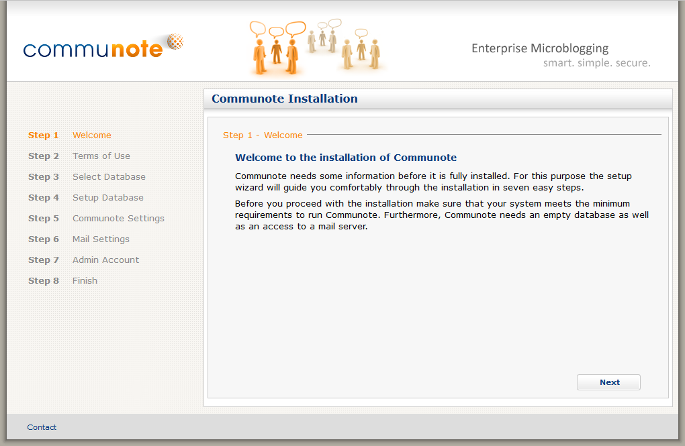

## 2.1 Types of installation

There are different installation packages for Communote:

**Installation with system integration script**

Tested with chosen Linux distributions. It contains a script which supports the system integration of the installation. This installation package already contains a Java Runtime Environment, therefore there is a 32 and 64bit version.

**Installation without system integration script**

Available for Linux and Windows.With this package you can start Communote without special configuration. However you have to install a Java Runtime Environment before installing Communote  In case you are not sure if the system integration script is working on your platform use this installation package.

**Installation by WAR-File**

Using the installation by a WAR-File the complete configuration must be done by hand.  The installation by WAR-File should only be done by experienced users.

To download the various packages or upgrade to a new version, visit the download area of our github project: http://communote.github.io/download/communote.war

## 2.2 Create Databases

Communote supports MS SQL, Oracle, PostgreSQL and MySQL. Download the JDBC driver    for your database system and copy the JAR file to the `lib` directory of your Tomcat installation.

### 2.1 For MySQL

Go to the PostgreSQL shell:

```nginx
mysql -u root -p mysqlpwd
```

First create a database for Communote and replace `communote_db_name` with the name of the database for Communote to use:

```sql
CREATE DATABASE communote_db_name CHARACTER SET utf8 COLLATE utf8_general_ci;
```

For security reasons a separated database user should be created and the database access to the Communote database should be limited. To do this execute the following statements in the MySQL Shell:

```sql
GRANT ALL PRIVILEGES ON communote_db_name.* TO 'communote_db_user'@'IP_COMMUNOTE_SERVER' IDENTIFIED BY 'communote_db_password';
FLUSH PRIVILEGES;
```

Replace `communote_db_name`, `communote_db_user` and `communote_db_password` with the database name, the database user and the database password. The `IP_COMMUNOTE_SERVER` needs to replaced by the IP of the Communote server. Copy and paste this line if you need other servers to access the database as well (e.g. for administrative access).

### 2.2 For PostgreSQL

Go to the PostgreSQL shell:

```nginx
psql -U postgres -W
```

It is recommended to use a separate database user with rights to access the communote database. You can create a new user with the following statement in the PostgreSQL shell:

```sql
CREATE USER communote_db_username NOCREATEDB NOCREATEROLE NOCREATEUSER ENCRYPTED PASSWORD 'communote_db_password';
```

Replace `communote_db_username` and `communote_db_password` with the name of the database user and the password.

The database can be then created with:

```sql
CREATE DATABASE communote OWNER communote_db_username ENCODING 'UTF8';
```

## 2.3 Installation

### 2.3.1 With system integration script

**Remark:** The installer script has been only tested on a Gentoo (up to date configuration as of Q3 2010) and for Ubuntu 10.04 LTS. You should only use the installer script for those distributions. Also make sure that your system has a current version (at least 4.1.3) of the shadow package installed.

For Linux distributions an Installer is available which will ship with all necessary components for Communote to run and configure them initially. The installer will also include the required Java Runtime Environment (JRE).
Using Linux you can download the installer with the command line tool wget. You will find an up-to-date version on the Communote homepage:

```nginx
wget http://www.communote.com/download/Communote-linux-x64.tar.gz
```

After downloading the installer you can unpack the installer. By default the command is:

```nginx
tar xvfz communote-installer.tar.gz
```

Now change into the directory of the just unpacked files and execute the following command:

```nginx
sudo bash ./setup.sh
```

Follow the instructions of the installer. It will go through the following steps (For every step default values will be suggested. You may accept them by just pressing the return key):

* **User und group:** Here you can define a user and group to be used as owner for the files to be installed. If user or group do not exist they will be created.
* **Port:** Here you can specify which port the application should  use. If the port is currently used, the installer will give you a  warning. You should then choose a different one.
* **Installation directory:** Enter the installation directory. The  application and necessary components will be installed into this  directory.
* **Data directory:** Enter the data directory for Communote.  In this directory the configuration data, cache data and by  default  the attachment repository will be stored here. Please  assure to have enough disk space available for this directory  since attachments will be stored there by default. The default  value for the data directory will be a sub directory of the  installation directory.


After completing the installation check:

1. Communote has been installed in the correct installation directory and
2. The file system rights have been set correctly on the provided data directory.

At the end of the installation procedure Communote will be started and you can continue with the installation using the web interface ([see section 2.4](#set-up-communote-with-the-installer)).

### 2.3.2 Without system integration script

For an installation without the installer script you will have to use one of the packages without the JRE (see section 1.1.). Use the tar.gz on Linux and .zip on Windows platforms.
To install Communote from these packages follow the instructions below:

1. Download and install the latest Oracle Java Runtime Environment (JRE) of version 7 (http://www.java.com/en/download/). After the installation of Java check that the correct version is returned when executing the command:

   ```nginx
   java -version
   ```

2. Unzip or untar the downloaded package into an arbitrary directory. This directory now contains among others a directory named communote which you copy into your preferred installation directory (``COMMUNOTE_INSTALL_DIR``).
3. When not using a PostgreSQL database download and install the appropriate JDBC driver for your database as described in the previous sections.
4. Configuration:
   1. Define the Communote configuration directory. Edit the file ``COMMUNOTE_INSTALL_DIR/communote/conf/context.xml`` and add the following entry in between the elements ``<context>`` and ``</context>``:

      ```xml
      <Environment name="communote.config.dir" type="java.lang.String" value="absolute path to configuration directory" />
      ```

      We suggest that you use the prepared configuration directory ``COMMUNOTE_INSTALL_DIR/communote/conf/communote``

   2. Configure the data directory which Communote will use for storing application data. This directory will also be used as the default location for saving attachments.
      1. Create a file called ``startup.properties`` in the Communote configuration directory.
      2. Add the absolute path to the data directory to the ``startup.properties`` file as shown in the following example. The example defines ``C:\Communote\Data`` as data directory. You should not select a directory within ``COMMUNOTE_INSTALL_DIR/communote/communote/`` because this would allow unauthorized users to access the content of that directory directly from their web browsers.
      `communote.data.dir=C\:/communote-data`
      **Note for Windows**:
      In front of the colon (`:`) you have to add a backslash `\` and all backslashes in the path have to be replaced by normal slashes `/`.
      So instead of `C:\Communote\Data` write `C\:/Communote/Data`.
5. Optional for Linux systems (recommended): Create or select a special user without root access that should be able to run Communote. This user must have read and write access for the data directory and should be the owner of the Communote installation directory.
6. Now you are ready to start Communote. To do this, go to the directory `COMMUNOTE_INSTALL_DIR/communote/bin` and run Communote with `startup.bat` (Windows) or `startup.sh` (Linux / as the correct user).

Continue the installation with the web interface ([see section 2.4](#set-up-communote-with-the-installer)).

### 2.3.3 By deploying WAR-File

First of all rename your downloaded WAR-file to `ROOT.war` and copy it to your Tomcat `webapps` directory. Remove the `ROOT` folder if it already exists.

You now have to configure the server before the first start:

1. If you run Tomcat 7 edit the files ``server.xml`` and ``context.xml``, so that every context-Element has the parameter ``useHttpOnly="true"``:

   ```xml
   <context ...  useHttpOnly="true" >
   ```

   This way the application will be more secure, as cookies containing session data can't be accessed via Javascript in modern browsers.
2. You need a data folder for storing attachments and application data at a preferred location, for example `communote-data`. The Tomcat needs by the way read and write access.
3. Create a sub folder `communote` into the directory `conf` of your Tomcat installation and put a new file called `startup.properties` in it.
4. In this file you have to define the absolute path to the data directory of Communote you created at the first step. Do this by adding the following line: `communote.data.dir=C\:/communote-data`
   **Note for Windows**:
   In front of the colon (`:`) you have to add a backslash `\` and all backslashes in the path have to be replaced by normal slashes `/`.
   So instead of `C:\Communote\Data` write `C\:/Communote/Data`.
5. Open the file `context.xml` at the `conf` directory of your Tomcat installation and add the following lines between the elements `<context ...>` and `</context>`.
   Replace the value for `communote.config.dir` with the absolute path to the `startup.properties`: The path must be in the format of your operating system. (Slash in Linux and Backslash in Windows). Escaping characters as in step 3 is not necessary.

   ```xml
   <Environment name="communote.instance.name"
       type="java.lang.String"
       value="communote" />
   <Environment name="communote.config.dir"
       type="java.lang.String"
       value="Absolute path to the directory that contains startup.properties without any escaping" />
   ```         

6. Now you can start your server.

## 2.4 Set-up Communote with the installer

Start your browser for the final installation and go to the homepage of your own Communote instance. By default it is accessible on the same host at `http://localhost:8080/`.

Now you should see the start screen of the web installer:



_Figure "Communote Installer Startpage"_

Follow the single steps. Every step and input is described in the installer. After a successful installation the installer should forward you to the login page of your Communote instance. There you can log in with your previously specified login data.
