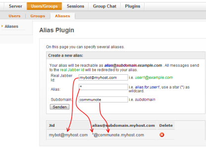
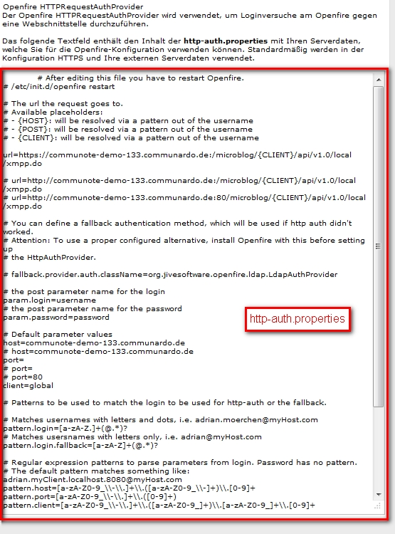
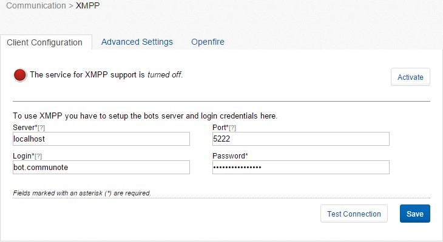
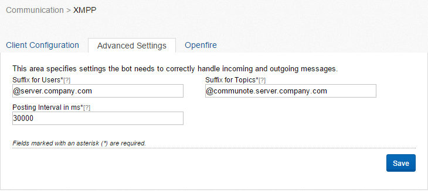

## 4.1 Introduction

If you want to use the XMPP integration with Communote you have to install Openfire.
At the moment version 3.6.4 is supported.

## 4.2 Installation of Openfire

Install Openfire using the packet management of your operating system or download it from the Openfire website:
[http://www.igniterealtime.org/downloads/index.jsp]()
It is recommended to use the installer version for windows.

## 4.3 Starting the Openfire Installation

1. In Linux, start Openfire as follows: Go to the directory ``<openfire.install.dir>`` and enter ``./openfire`` start.
   In Windows you can start or stop Openfire using the start menu.
2. Openfire will be started in the background and the administration console will be available under: [http://localhost:9090](). Go to this URL and follow the installation instructions.
3. Choose your language.
4. Configure the server settings: Please check the host name.
5. Configure the database: Choose "**Default database connection**".
6. Configure the database settings: It is recommended but not necessary to use the same database type as you have chosen for Communote. Before the database can be initialized you have to create it. Execute the following SQL statements on your database, replace ``openfire_db_name`` with the database name and ``communote_db_user_name`` with the database username:
   1. For  MySQL use:

      ```sql
      CREATE DATABASE openfire_db_name CHARACTER SET UTF8
      ```

   2. For PostgreSQL use:

      ```sql
      CREATE DATABASE openfire_db_name OWNER communote_db_user_name encoding='utf8'
      ```

7. Profile Settings: Please use the default settings.
8. Administration account: Please enter the login and password for the initial administration account.
9. Now you can login with the administration account using the following URL [http://localhost:9090](). By default the username is **admin** and the password is the one you specified before.

## 4.4 Configuration of Openfire for Communote

The Communote Installer contains two plugins for Communote. Please copy those to the following destinations:

* ``openfire-alias-plugin-VERSION.jar`` to ``<openfire.install.dir>/plugins``
* ``openfire-auth-provider-VERSION.jar`` to ``<openfire.install.dir>/lib``

The plugins will be found and installed automatically by Openfire after a few seconds. Now follow these steps:

1. Open the Openfire administration console ([http://localhost:9090]()) and log in with your administration account
2. Change to **User -> Groups**
3. Create a new user
4. Choose ``bot.communote`` as user name and define a password. Do not assign admin rights to this user.

Proceed as shown in Figure "Openfire Alias Configuration":

1. Change to **User -> Aliases**
2. Create a new alias: Replace the hostname with the FQDN (Full  Qualified Domain Name) of the host Openfire is running on (e.g. server.company.com):
   **Real Jabber Id:** ``bot.communote@hostname``
   **Alias:** ``*``
   **Subdomain:** ``communote``



_Figure "Openfire Alias Configuration"_

Create a file ``http-auth.properties`` in the following directory: ``<openfire.install.dir>/conf/``. Go to the Communote XMPP configuration by following **Administration -> System Administration -> Communication -> XMPP -> Tab Openfire Configuration**. Copy the content of the text box into the just created ``http-auth.properties`` file:



_Figure "http-auth.properties"_

Now you have to make the following changes to this property file:

* The login of the administrator and the login of the user created before must be defined in the property file. The password must be stored as SHA-1 Hash.
  With Linux the SHA-1 Hash can be computed as follows:

  ```sh
  printf 123456 | sha1sum
  ```

  Add the following lines to the http-auth.properties file:

  ```properties
  allowed_user[0].user=admin
  allowed_user[0].password=*SHA1-Passwort*
  allowed_user[1].user=bot.communote
  allowed_user[1].password=*SHA1-Passwort*
  ```
* Check the settings in ``url=``.
* In the Openfire administration, go to **Server -> Server  Administration -> System Settings**.
* Add a new property (or change it if it already exists):
  **Name:** ``provider.auth.className``  
  **Value:**  ``de.communardo.xmpp.openfire.auth.HTTPRequestAuthProvider``
* Now restart Openfire to activate these changes.

## 4.5 Configure Communote to use XMPP

* Go to the Communote administration area.
* Go to the menu **Communication -> XMPP**.
* Set the following values in the tab **Client Configuration**:

  

  _Figure "Page for XMPP -Settings"_

  * Server: Enter the host name of the Openfire server. In case the server is running on the same host as Communote you may just enter ``localhost``.
  * Port: Enter the XMPP port Openfire will be running on.
  * Login: Enter the login of the bot which you defined during the configuration of Openfire. The default name is ``bot.communote``.
  * Password: Enter the password of your bot.
* Check your connection. If this fails please check the configuration in Communote and the configuration of Openfire.
* Enter the following data in the tab **Advanced Settings**:

  

  _Figure "Advanced Settings for the XMPP Communication"_

  * Suffix for users (@hostname): Replace ``hostname`` with the FQDN hostname of the Openfire server, for example: ``@server.company.com``.
  * Suffix for blogs (@subdomain.hostname): Replace ``subdomain`` with the subdomain of the alias configuration in Openfire. Replace ``hostname`` with the FQDN hostname of the Openfire server, for example: ``@communote.server.company.com``.
  * Time to wait: The user must wait at least the given amount of time to post another message using XMPP.
* Activate the XMPP service in the tab **Client Configuration**.
  **Note:** An activated service does not necessarily mean that the communication will work. Therefore please check after activation:
  * Is the bot logged-in in Openfire?
  * Are you able to establish a connection to the Openfire server using a XMPP client (such as Digsby or Pidgin) with the connection data provided in your user profile?
  * Activate the XMPP notifications in your user profile and check if you receive an XMPP notification when a Communote message is posted to you.
  * Please check if you are able to post to a blog using XMPP.
