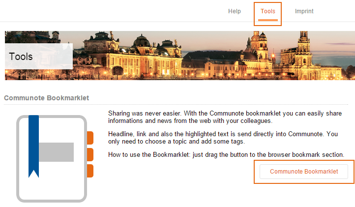
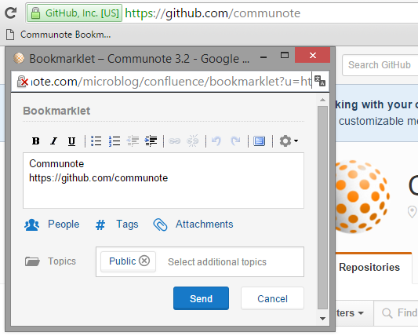

Go to "Tools" at the topbar in to install the bookmarklet.

_Figure "Bookmarklet page"_

Drag the button "Communote Bookmarklet" to your browser bookmarks.

If you want to share a website just click on your bookmark and the bookmarklet will appear in a popup with the title and URL of the website you want to share.

_Figure "Bookmarklet popup"_
