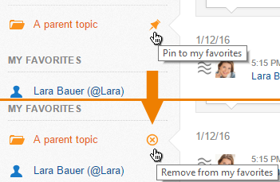
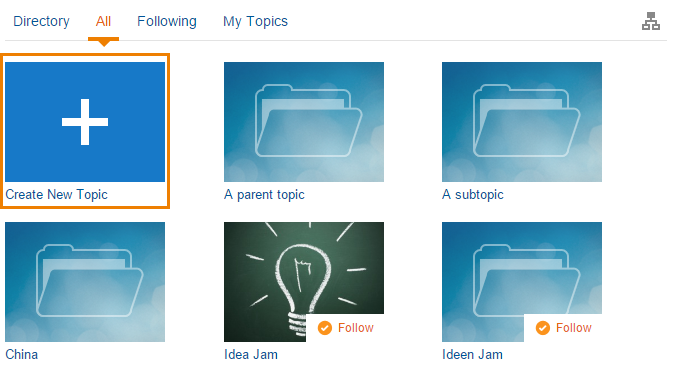

## 2.3.1 Topic localization

### 2.3.1.1 Choose a topic | Filter topics

There are three different ways to choose a topic. The first way is to search for the name of topic at the "Choose & Open" search input at the top left corner of the interface. To click on a topic name at the meta information of a note is the second way. The last way is to go to the topics overview and choose your topic. If you have chosen a topic, the search function (see below) will now be applied to this topic. If you would like to change back to all notes, just go to the notes overview at the sidebar.

_Figure "Choose a topic"_

### 2.3.1.2 My favorites

If you have topics that you frequently read or write in, you can save them as a favorite in order to make them available more easily in the future. If you open the topic that you would like to choose as a favorite, you can "pin" it to the list of favorites.

If there are new notes in one of your favorite topics, you will be notified. You can erase a topic from your favorites by clicking the "X" next to the name of the topic.

_Figure "Pin topics as favorites"_

## 2.3.2 Create and edit topics

You can create a new topic in the topic overview. Choose the plus-sign that is included in the first position of the overview (Figure "Create a topic") and a new window will appear that lets you specify the topic details (Figure "Specify topic details"). After creating a new topic, you will automatically be the topic manager.

_Figure "Create a topic"_

_Figure "Specify topic details"_

You as the new topic manager can specify the topic title or alias and you can see and edit the topic details. You can also apply a protocoll that will make all changes in access rights a systemwide note. Please note, that this system note can not be erased. In the topic details, you also have the possibility of erasing the topic.

After creating a topic, it will appear in the topic overview page and can be found with the search functin. If you would like to apply changes, you can choose the tab "info" and then "edit topic" (Figure "Topic Information").

Here you can also change the topic picture (for the overview page), the banner, access rights and the topic structure. Additionally you can also invite new users in this function.

_Figure "Edit Topic"_

To connect different topics with each other hierarchically, you can define subtopics. Therefor you have to click on "Topic Structure" in your topic settings. In the next step you can assign subtopics to your topic by typing in their names into the search field.

_Figure "Define Subtopics"_

As the creator of the topic you are automatically assigned as the topic manager of the topic. You can assign new topic manager to the topic and assign other access rights to the users. While typing in the name, Communote will automatically suggest users to you. You can now pick "manage", "read" and "write" as access rights. If you assign "manage" to a user, he will now have the same rights as you. You can also edit access rights with a click on right and erase the user by clicking "erase".

_Figure "Access Rights"_

Additionally you can invite new users. You therefor choose the tab in the topic manager and type in the name and abbreviation of the user and suggest a language and access right to him. The abbreviation can not be changed afterwards. If you now choose "invite user", the new user will receive an e-mail that informs him about the topic and the access rights that have been given to him.

_Figure "Invite Users"_
