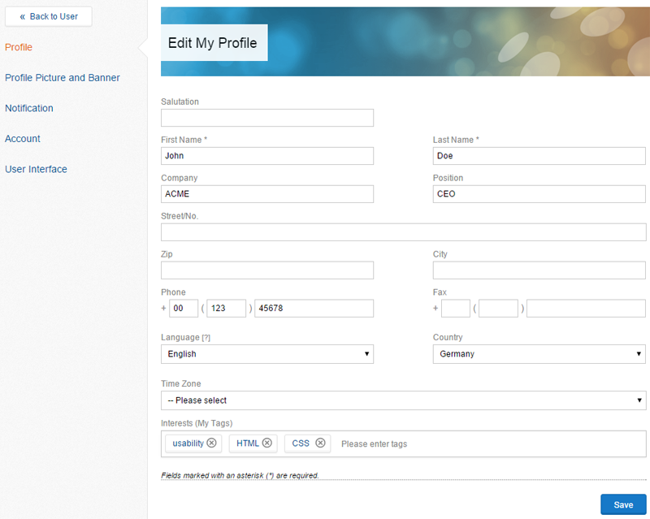
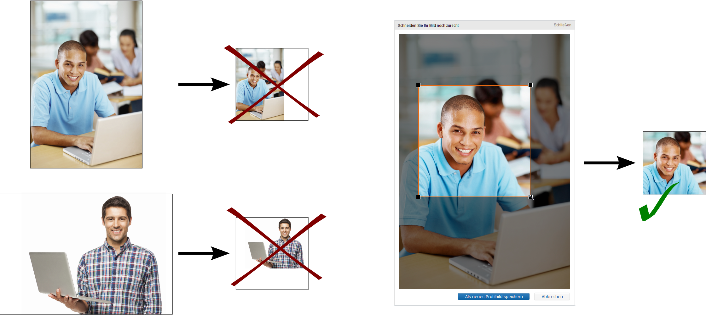

As you are choosing "Your Name" in the top menu bar and then click "edit profile", you can change profile details like your company, phone number and tags.

_Figure "My Profile"_

You can also change your profile picture if you choose "Profile Picture and Banner" and then "Choose a file" and choose the correct file for your profile picture on your computer. Now you can set the area of the picture that you would like to use. If you choose "Upload Profile Picture", the picture will automatically be linked to your profile. If you would like to use the default picture again, choose "use default" and your profile picture will be erased.

_Figure "Adjust profile picture"_

The process for adjusting the banner is very similar: You can also find it in the are "Profile picture and banner". For the banner it is important that it has the correct size of 960px*100px in order for to be shown correctly.

"Notification" lets you adjust your notification options. You therefor need to make sure that the email address that you have received your first Communote email from is listed as a "secure address". Otherwise your notifications will be put into the Spam-Folder of your inbox.

You can be notified about the following options:

*   mentions - You will be notified if there is a note in which you have been mentioned with @YourName (former standard)
*   Discussions you took part in - You will be notiffied if there is a new answer in a discussion that you have been part in, meaning have written at least one answer
*   When someone "likes" a note of yours

Additionally you have the option to change you email address and to set a new password. The bar on top of the password inbox, how secure your password is. If you would like to erase your account, you can also do that here. Depending on your system, you may be able to choose between erasing all your data and notes and erasing your account without erasing your notes.
