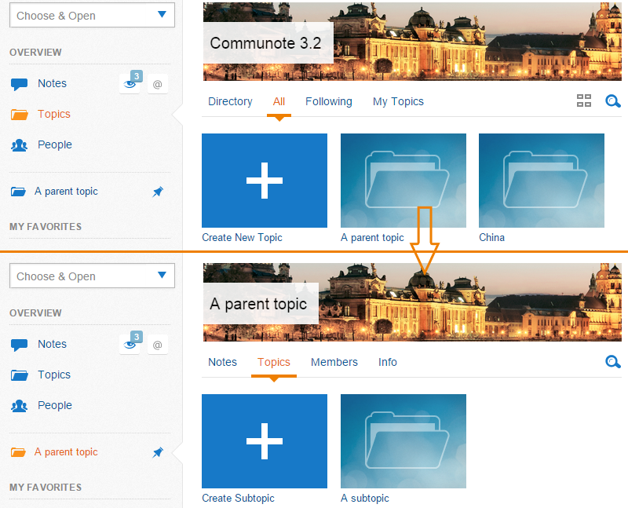
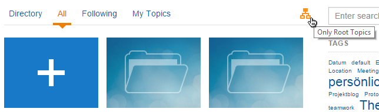
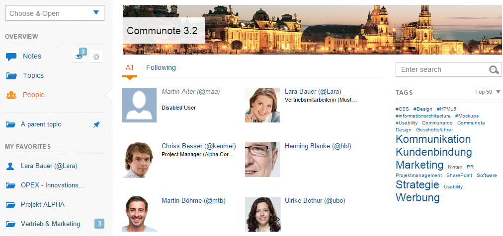
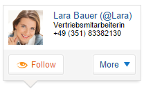
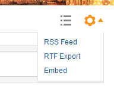

## 2.2.1 Note view

Within the Communote system there are two different ways of viewing a message:

*   The stream view which shows all notes seperately in the order of their creation (see "View Modes" - right). You can always switch to the discussion view:
*   the discussion view shows a conversation (mother post and comments) as it appeared in one post (see Figure "View Modes" - left)

_Figure "View modes for notes": Discussion view (left) or Stream view (right)_

In order to switch between the views, you can choose the button above the note.

_Figure "Change view mode"_

## 2.2.2 Topic and People Overview

On the left hand's side of the interface you can find the tab "Topics" with all topics that you have access to. You can choose which topics you would like to follow. Two ways of viewing the topics are available: You can view only root topics (no subtopics) or you can view a complete list of all topics sorted in alphabetical order.

On the right hand's side you can additionally search for tags and topics.

_Figure "Topics and subtopics"_

You can switch between the views by clicking on the button on the right side above the topic list.

_Figure "View modes for topics": All or only root topics_

Next to the topic view you will find the tab "People". Here you can find all People that are registerted to your Communote in alphabetical order. Equal to the topic view you can also see which users you follow and add new users to follow. You can also search for tags within this view.

_Figure "Overview Users"_

## 2.2.3 Organize Notes

### 2.2.3.1 Bookmark a Note

In order to get a better overview of your Communote system and not to get important notes out of sight you can "bookmark" notes. Below the note, next to "answer" and "like" there is an option for "bookmarking" the note (Figure "Bookmark"). If you have chosen to bookmark the note, it will from now on appear in your tab "Bookmarks". You can remove notes from your bookmark list by clicking that option "bookmark" within the specific note for a second time. The note will no longer be part of your bookmark list.

_Figure "Bookmark"_

### 2.2.3.2 "Follow" Notes

Another option for filtering Communote specifically for your interest is the "Following"-function. With its help you can directly follow specific activities within a topic. You can follow topics, tags and users. All notes that apply to your following-requirements will apear in your "Following"-Tab. You can activate new criteria in the topics and people overview or you just use the follow button inside the hovercards (Figure "Follow a person"). If you no longer want to follow a topic or person, you must click the follow-button again.

_Figure "Follow a person"_

### 2.2.3.3 "Like" Notes

Additionally to following and bookmarking a note, you can also give quick feedback with the "like"-function with which you can show the other users that you liked that note. Just choose "like" (the thumb symbol) in the options below that note. You can now also see, who else likes the note.

_Figure "Like a Note"_

### 2.2.3.4 RSS & RTF

Above the list of notes you can find a knurl for further note-options. Here you can either do a RTF-export and convert the current note list into another type of document, that can be opened for example with MS Word. The RSS-Feed lets you subscribe to all changes within that topic via RSS-Feed.

_Figure "RTF and RSS"_

Depending on you RSS-Program, there may be differences in the way RSS-feeds can be subscribed to. Please make sure that your RSS-reader supports authentified feeds.
