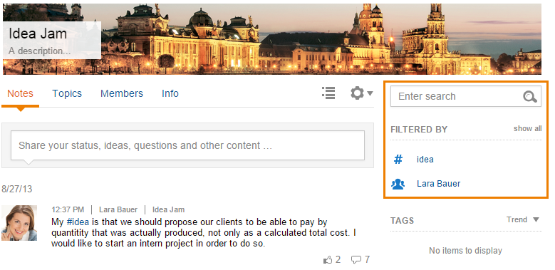
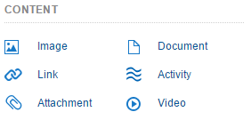
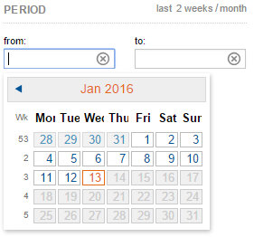

If you are looking for a specific message, Communote supplies an extensive search function in order for you to find it.

You can filter for a specific note by text, tag, author and topic. Only one click onto the tag or user filters Communote for that tag or person. You can also choose a search tag directly from a note or you can pick a tag from the tag cloud on the right side of the interface. You can also type in the tag you are looking for there. Below the search field there will now appear the filtered tags and users. By clicking on the words for a second time, you can erase them.

Note: The different filters can be combined with each other. The more filters you apply, the fewer search results you will get.

## 2.4.1 Context Search

If you are searching for a specific note content, you can search for that content in the search field without user using the other search functions. Just type in the keywod you are looking for and press "Enter". You will now be proposed possible tags that you can choose directly from. If none of those tags apply to your search phrase, just keep on typing in the correct phrase.

_Figure "Context Search"_

## 2.4.2 Tagcloud

The tag cloud supplies you with an overview of the tags that are frequently used in the microblog. The bigger the tag is in the tag cloud, the more it is used in the microblog. If you choose a tag from the tagcloud, you will be guided to a filtered search.

_Figure "Tagcloud"_

## 2.4.3 Author filter

With the user filter you can search for notes that have been written by a specific author. You will receive an overview of all users that have write access to the topic you're looking at and can select an author by clicking on their profile picture. You will be able to see the username abbreviation when you pass your mouse over their profile picture.

_Figure "Author filter"_

## 2.4.4 Content Filter

The content filter is useful if you are looking for a specific format of a note or an attachment. You can directly choose what the note you are looking for is supposed to contain: A picture, document, link activity or a video? If you choose one of those contents, only notes will appear that contain that specific content.

_Figure "Content Filter"_

## 2.4.5 Period Filter

You can also choose a period of time in which you note was written. The quick launch will let you choose the last week and the last month, but you can also choose a very specific period of time in the mask. Therefor a small calender will appear in which you can pick the right period of time. The arrows on top let you jump between the months.

_Figure "Filter for a period of time"_
