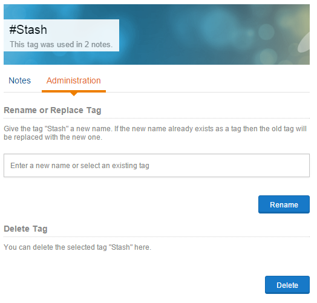
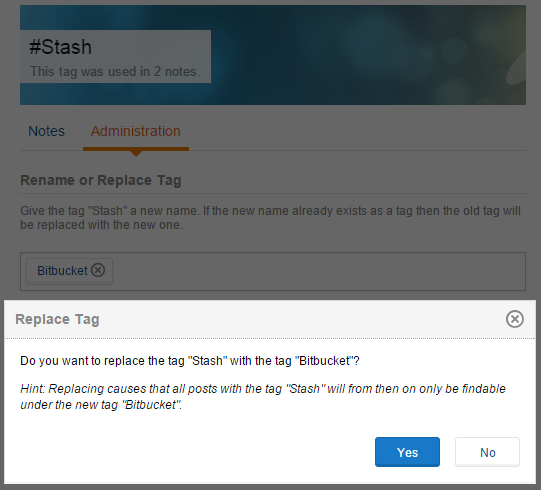

The Communote administrator have the ability to manage all tags used in notes. For him it is possible to rename, replace and delete tags.
The best way to access the administration page for a tag is to use the global search at the left sidebar and search for the specific tag. Another way to access the tag page is to use the hover cards of a tag inside a note.
At the tag page you able to see the tab "Administration" as administrator:

_Figure "Tag Management"_

At the first section of the tag management you able to rename the tag or replace it with a existing tag. To rename a tag you have typing a new name into the input and click the "Rename" button. If the entered tag already exist then you will see it in the auto suggestions. By selecting the tag from there and clicking the "Rename" button, a dialog will ask you whether or not replacing the old tag with the new one:

_Figure "Replacing an old tag with an existing"_

Replacing causes that all posts with the old tag will from then on only be findable under the new tag. If the tag name was written directly in a note then only the link will be replaced but the text will remain unaffected.

At the second section of the tag management you able to delete the tag by clicking the button "Delete". A dialog will ask you if the tag should deleted and a confirmation will removed the tag link from all notes that use it.
