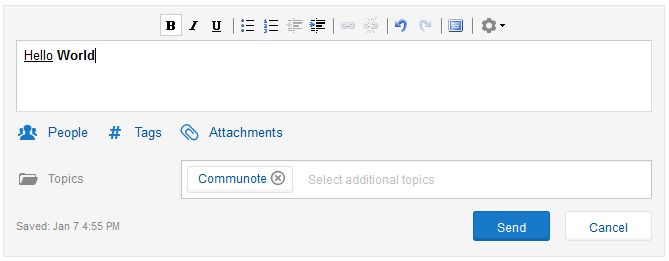
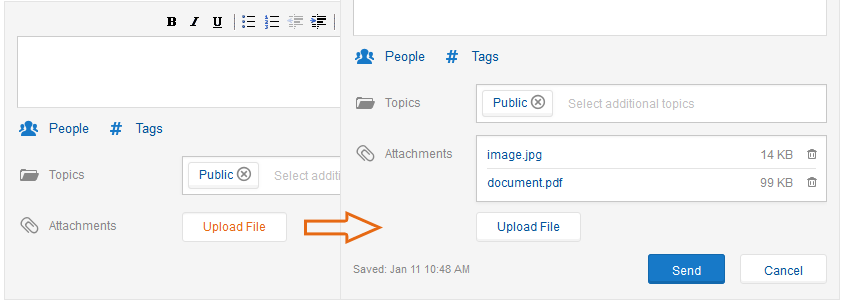
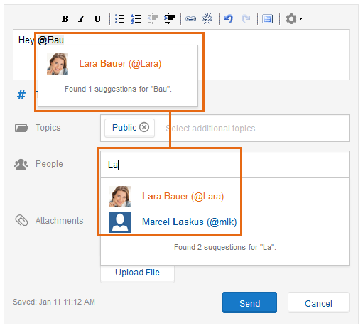
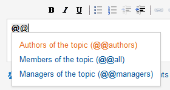
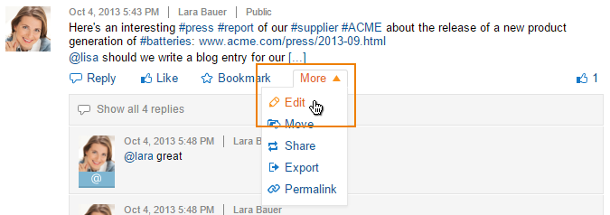
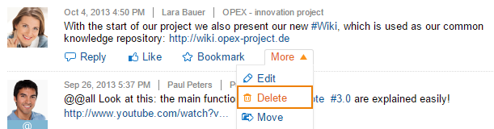
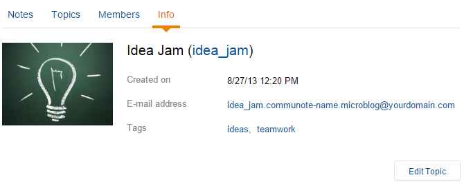

Using Communote you can quickly and easily write notes, messages or protocols. You are thereby not - unlike other microblogging services - limited to a number of letters. You can add easy formats to your note and attach any kind of data to it. Pictures with the formats JPG, PNG or GIF will automatically be transformed into a preview within the note. It is possible to attach a video-link from YouTube or Vimeo, witch will be embed into Communote. You can also notify your colleagues using @mentions.

## 2.1.1 The Editor

If you want to write a new note, you will always find a small editor field above the list of notes. When you click in that field, it will change into the note editor that we have already shown you in Chapter 2. Now you can start writing right away. You can add easy formatting options like **bold**, _italic_ or <u>underlined</u> to your message.

The editor has further options for your message ("Topic", "People", "Tags" and "Attachments") that will help you add additional information and content to your note. Those options are not mandatory and can be used on demand. If you choose one of those options, a new input field will appear in which you can add the information.

_Figure "Editor"_

### 2.1.1.1 Topics

Within Communote notes are always **specific to a topic**, meaning that before sending a note in, you have to decide in which topic the note will be saved in. Communote makes that selection easier for you by choosing the topic that you have selected by default. If you don't have the rights to write into a topic or if you are in the general message view, a default topic will be chosen for your note by default. You can always change that default option or add more topics to the selection. A new function of version 3.0 is that you can write into a different topic from the one that you are currently reading.

In order for the note to be posted, at least one topic has to be chosen. You can use the "send"-button or the combination Ctrl + Enter to send the message.

_Figure "Choose topic in editor"_

### 2.1.1.2 Tags

Tags have the purpose to structure Communote and make the search for content easier. There are two ways that can be used to insert tags into a note: Firstly they can simply be added into the note with a hashtag (#) before the tag and secondly they can be added with the option "Tags" below the editor (see "Using tags in the editor").

While you are still typing, Communote already suggests tags that have been used in Communote before. You can either user one of the suggestions or overwrite them and add a new tag to the system. If you don't need the suggestions, you can easily blend out the list with the Esc key. You can also blend them out permanently for all future messages in the menu of the editor (the gear on the right hand's side of the editor).

_Figure "Using tags in the editor"_

### 2.1.1.3 Attachments

Communote offers the possibility of adding attachments to the note and sharing them with other users. The standard configuration limits the data size to 10 MB. Please contact your Administrator, if you would like to know the exact size limit of the attachments.

You can add an attachment to your note by choosing the option "attachments" below the editor. You can now choose a file from your computer and add it to your note. Before sending in your note, you can re-check the attachment and erase it if that's necessary.

_Figure "Attachments": Add files to your note (left) and re-check the attached files before sending them in (right)_

### 2.1.1.4 Notification of other users

You can notify other users about your note inside of the note or you can address them directly. The users will be notified via E-Mail and Communote will show that they have been mentioned in a message.

There are again two ways of mentioning other users in a note: Firstly you can add the username of the user with a @-sign in front of it within the text of the note. Secondly you can use the "People"-function below the editor and type in the name of the person you would like to notify manually.

You can find out the username of the user by hovering the profile picture with the mouse and waiting a short time until the username shows up. Alternatively just start typing the name and Communote will suggest matching users automatically.

_Figure "Notification in the editor": via @-Sign or with the option "People"_

_Figure "Finding the abbreviation"_

If you would like to notify more than one person with one note, you don't have to notify everyone separately. You can simply address certain groups of users with a doubled @@-sign. All users belonging to that group will be notified about the message as it is sent. An overview of the supported groups and the users they comprise is outlined below:

| Mention Syntax   | Description |
| ---------------- |-----------------|
| **@@all**        | All users with **reading rights** for the topic will be notified |
| **@@authors**    | All **authors (users with write access)** of a topic will be notified. As soon as a user has written one note/answer, he is counted as an author. |
| **@@managers**   | All **topic managers** will be notified. |
| **@@discussion** | All users that have **written an answer** in the discussion will be notified. _(This function is only available if the note is an answer!)_ |

_**Note:** Direct messages can only be sent to @@managers._

_Abbildung "Address certain groups of users"_

The standard configuration limits @@-mentions to 100 users. If one of the groups represents more than 100 users, the @@-function can not be used and the message won't be sent. You will receive an appropriate error message in that case. The limit which is configurable is helpful for larger companies to avoid excessive email traffic.

### 2.1.1.5 Links

Within Communote you can also create Hyperlinks for your note. The easiest way to do so is the type in the URL of the internet address. Communote automatically identifies it as a link and transforms it. You can also mark specific words or a group of words as a link. Therefor you mark the words and choose "Insert link" in the editor options. You now type in the URL and the title in the new window and click "Insert" (see Figure "Insert Hyperlinks")

_Figure "Insert Hyperlinks"_

Furthermore it is possible to link messages with each other within Communote. All you need is the **permalink** of the note that you would like to link. The permalink is a permanent identifier of the note and can be found when "more" and "permalink" is chosen below the message. You don't need to click on that field, you can also simply copy the link to your clipboard (with a click of your right mouse button) and then insert it into your note.

### 2.1.1.6 Emoticons

Communote supports a selection of the most common emoticons which will be automatically replaced with icons after the note was sent. An overview of the available smiley-codes with the associated icons is depicted in the next image.

_Figure "Emoticon Cheat sheet"_

### 2.1.1.7 Autosave

As you are writing or editing a note, Communote automatically saves what is typed into the editor. You will then see a sign "Saved" with a date below the editor. If you need to take a break or your work has been interrupted, the last save will automatically be loaded into the editor as you open it again. You will then be able to see the message "Backup has been loaded" below the editor. You can also click "cancel" if you don't need the autosave anymore.

**Note:** Communote only saved one autosave per note. If you start a new note in another browser, the former backup will be overwritten.

_Figure "Automatic Backup of a Note"_

## 2.1.2 Comment and answer notes

If you have write access to a topic, you can answer to any message within that topic in order to give your colleagues feedback. The functionality of the answer-editor is identical to the editor for writing notes with one exception: The topic is already predefined and cannot be changed.

In order to write an answer, you can pass the specific note and then click "answer". The editor will now open and by default the author will be notified. You can send your note by clicking "send" or by using the shortage CTRL+Enter.

If you are watching the notes in discussion view _(Comments are shown directly below the note)_, there is a quick answer function with an easy input field and no format options right below the note. You can switch to the Rich Text Editor easily by clicking the arrows on the right hand's side of the quick editor.

_Figure "Create a quick answer"_

## 2.1.3 Edit notes

If you have made a mistake or if you have missed some important information, you can edit the notes after you have sent them (Figure "Edit notes"). In order to edit, you pass over the note and then choose the action "edit" which you will find under the option "more". The editor will now load automatically and you can edit the note. When you are finished, you can click "save" or use CTRL + Enter.

_Figure "Edit notes"_

## 2.1.4 Delete Notes

Furthermore you have the option to delete a note after it has been sent (Figure "Erase Notes"). You will find that function under "more" and "delete" below the text of the note.

**If you want to delete a note, the following conditions apply:**

*   You may delete a note, if you are the **author of that note**.
*   You may delete the note, as long as there is **no answer to it** yet.
*   You may delete notes from other users if you are the **manager of the topic.**
*   You may also delete discussions, if you are the **manager of the topic**.

_Figure "Erase Notes"_

## 2.1.5 Move Notes

A note or a discussion can be moved into another topic by the author or the manager of the topic using the function "move".

If you would like to move a note or discussion, the following conditions apply:

*   Only the entire discussion can be moved. Single answers cannot be moved.
*   You can only move a note or discussion into a topic where you have write access.

_Figure "Move Notes"_

## 2.1.6 Writing notes via E-Mail

You can write new notes via E-Mail, without being logged into the Communote system. You only need to know the email address of the topic that you would like to write in and have a valid user account.

You can find the email address of the topic in the profile of the topic. In order to get there you choose a topic via "Select and Open" and then click onto "Info" in the horizontal navigation below the banner (Figure "Topic Information"). The email address will be shown in the information that is shown here. If there is no address to be found, the function may be disabled in your system.

Depending on the configuration of the system, a topic can have a unique email address or there may be only a system-wide address for all topics. In case there is only a system-wide address, you specify the topic in the reference headline.

_Figure "Topic Information"_

If you would like to send in a note via e-mail, you need to use the address of your specific topic. Tags (#) and mentions (@) can be used the same way as the editor in the system. Attachments can also be integrated into the e-mail.

_Figure "Send a note via e-mail"_

If you receive an email with a notification about a new note you can also use the answer function of your email program. Communote will transfer your answer into a regular Communote note. Answer will remain within a discussion and the topic remains the same.

Important: Don't change the address or the subject headline of the email!

**If you would like to send a note from you mailaccount, the following conditions apply:**

*   You need to have a **valid user's account** for the Communote system.
*   You need to write from the email address that is **connected to your Communote user's account**
*   The subject headline is import if there is only a system-wide mail address. If there is a specific address for your topic, the headline will not be in use.
*   If you want to answer to a note, you need to use the **reply function.** Otherwise there will be a new note, not an answer.

## 2.1.7 Direct Messages

Direct messages are private messages between two or more users. They are only visible to the author and the addressee(s) and can be written as a response to another note or as a new note, but it has to be marked as a direct message within the note and it must be addressed to one or more specific users.

Again there are two options for marking a note as a direct message. You can either mark it directly in the message by starting the note with a d (for direct message) followed by a space and then followed by the mentioning of the addressee (@user). If you are addressing more than one user, they must be separated by an empty space (Figure "Direct Messages"). The other way is again in the options: Below the input field of the users that you would like to notify is a field "send as direct note". If you check that field, your message will be send as direct note.

_Figure "Direct Messages": Mark a note as a direct message_

If you have write access to a topic, you can directly answer to the note. You can now either answer all addressee of the note or only a selection. It is not possible to include additional users in an answer to a direct message.

**If you would like to send a direct message, the following conditions apply:**

*   A direct message can be edited and erased as long as there is no answer to it yet.
*   A direct message can be transformed into a "normal" message via editing.
*   It is on the other hand not possible to transform a "normal" message into a direct message.
*   @mentions within the note do not apply as addressee of the note.
*   Answers can only be send to all addressees of a direct message
*   addressees can be excluded when answering to a direct message.
